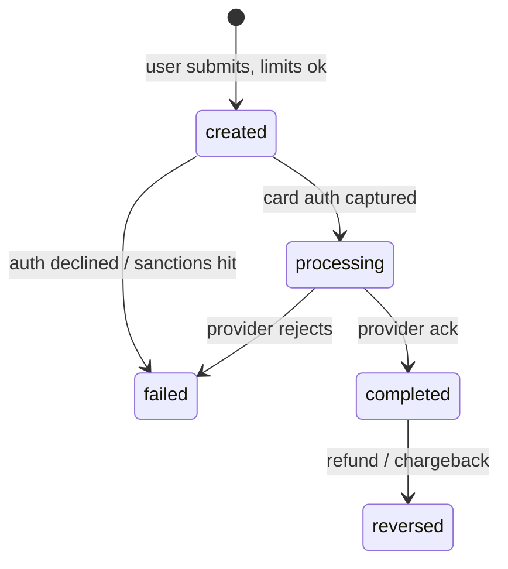
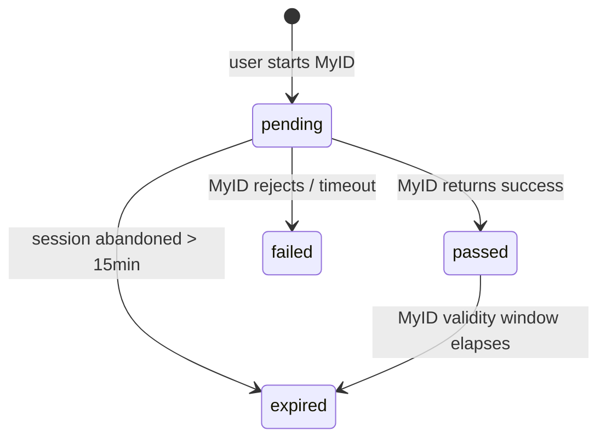
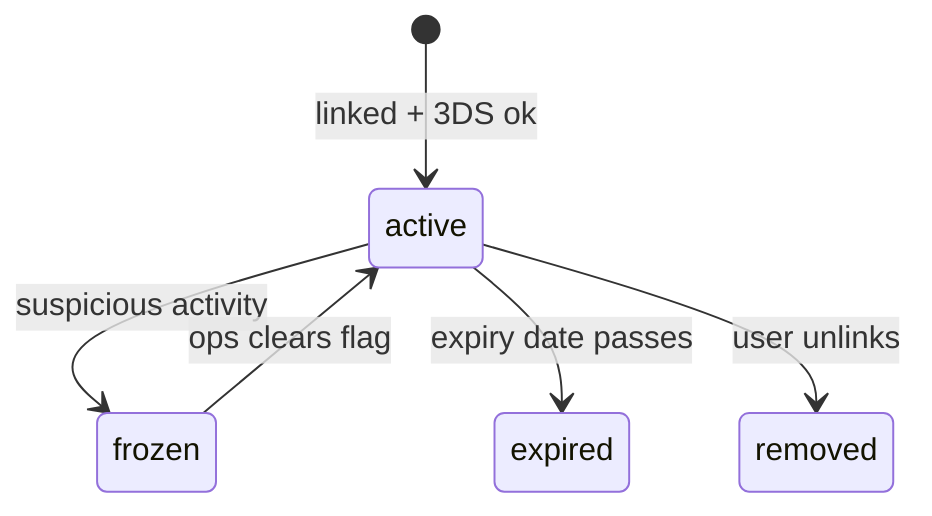
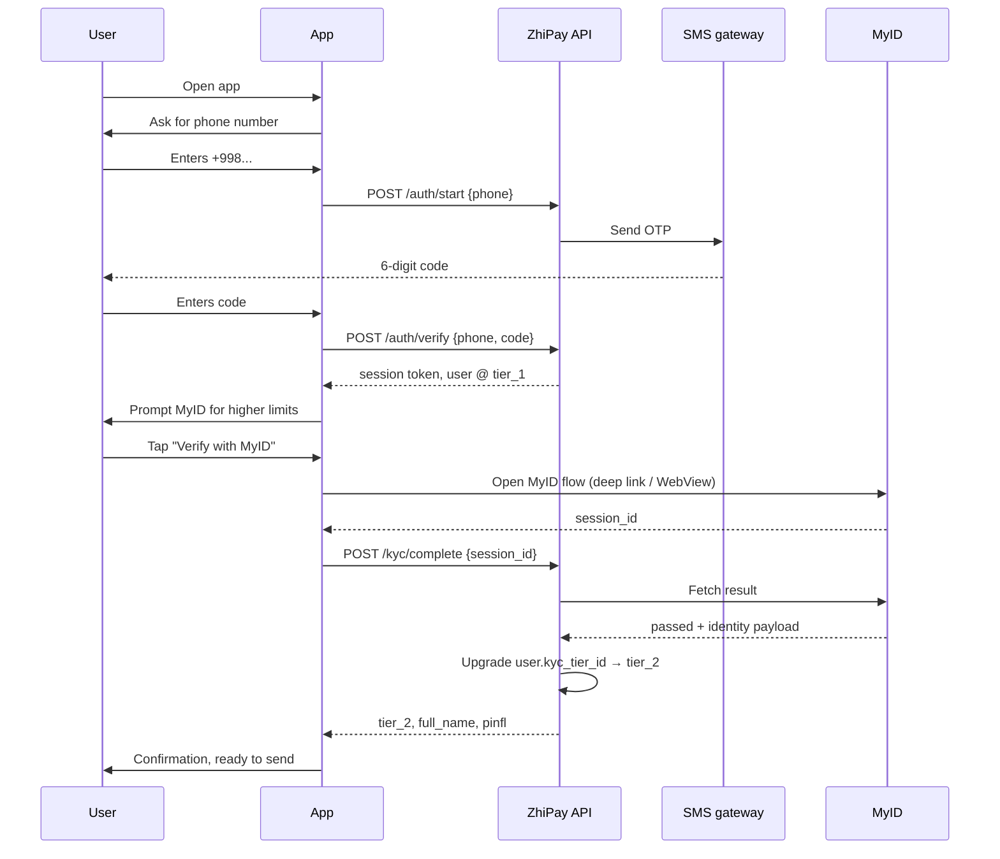
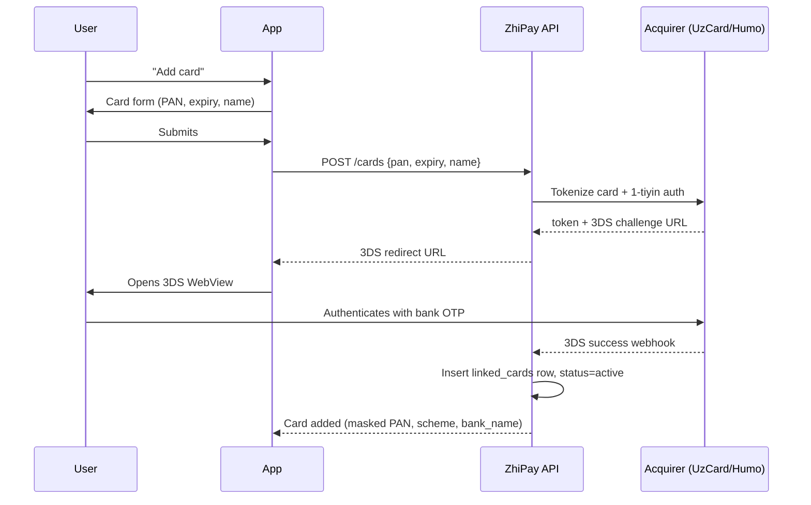
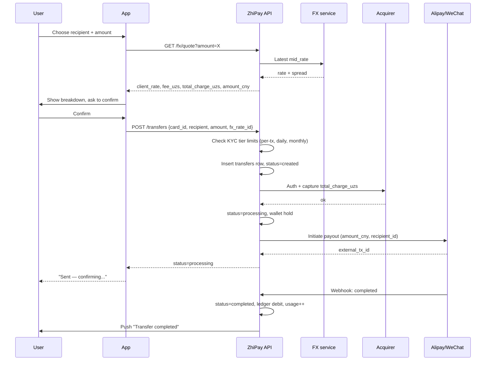

# ZhiPay Mobile — Design Rules Pack

> Companion to `brief.md`. The constraints, doc slices, and canonical diagrams Claude Design needs to design ZhiPay mobile correctly.
>
> If a rule here conflicts with a fact in the doc slices (§11–§14), **the doc slices win** — they're sourced from the authoritative repo docs.

---

## 1. Core principles

- **Mobile-first.** Smallest viewport first.
- **Trust through transparency.** Every fee, rate, limit, and status visible **before** the user commits. No hidden cost, no surprise rejection, no FX recalculation mid-flight.
- **Localization-first.** `uz` is the default — design and copy-review in Uzbek first. `ru` and `en` are first-class. RTL not required for v1.
- **No PII leakage.** Full PAN, full PINFL, full document number **never** displayed in UI — not even briefly, not on tap-to-reveal.
- **Money correctness in copy.** Every amount shown with currency code + locale-aware separator. Never display raw `bigint` minor units.
- **Compliance is a feature.** KYC and AML interactions are designed for the actor (end-user), not bolted on.
- **No raw timestamps.** Always formatted relative to the user's locale (`DD.MM.YYYY` for `uz`/`ru`, `MMM D, YYYY` for `en`). Relative time ("2h ago") for recent events; absolute for > 24h.
- **Fail loudly, recover gracefully.** Failed transfers explain why and offer the next action, sourced from `error_codes`. Silent failure forbidden.
- **Explicit over implicit.** If a screen's behavior isn't obvious from looking at it, fix the screen — not the spec. No tooltip-only affordances for primary actions.
- **Match the schema.** Never propose UI that contradicts the data model. Never invent states.

---

## 2. Money & FX rendering

### Storage vs display

Backend stores amounts in **smallest currency unit** (`bigint`):
- UZS in **tiyins** (1 UZS = 100 tiyins)
- CNY in **fen** (1 CNY = 100 fen)

UI **always** divides by 100 at display time. Never store, pass, or render floats.

### Formatting per locale

| Locale | UZS example | CNY example |
|---|---|---|
| `uz` / `ru` | `5 000 000 UZS` | `2 500 CNY` |
| `en` | `5,000,000 UZS` | `2,500 CNY` |

- Group separator: space (`uz`/`ru`), comma (`en`).
- Decimal separator: comma (`uz`/`ru`), period (`en`).
- Currency code follows the amount, separated by a non-breaking space.
- Never round before display — backend already enforces `floor(amount_uzs × client_rate)`.

### What never appears in UI

| Forbidden | Use instead |
|---|---|
| `5000000` (raw tiyins) | `50 000.00 UZS` (formatted) |
| `1.234567` (rate as float string) | `1 234.57 UZS / CNY` |
| Any float for money | `bigint` divided by 100 |

### Send-money review breakdown — required structure

Every send-money review screen renders these lines:

```
You send                  5 000 000.00 UZS
Service fee                  50 000.00 UZS  (1.0%)
FX spread                     5 000.00 UZS
─────────────────────────────────────────
Total charge              5 055 000.00 UZS
─────────────────────────────────────────
Recipient gets                3 600.00 CNY
Rate                  1 CNY = 1 404.17 UZS  (locked)
```

Source fields (from `transfers`, `transfer_fees`, `fx_rates`): `amount_uzs · fee_uzs · fx_spread_uzs · total_charge_uzs · amount_cny · client_rate`.

### Rate-lock countdown

If the FX quote has a TTL: display `Rate locked for 02:34`. When countdown hits 0, fetch a new quote and show a diff if the rate moved beyond a threshold. **Never silently substitute a new rate.**

### Rate immutability after submit

Once `transfer.status = processing`: the locked rate is **immutable** for that transfer. Detail screens display the historical `client_rate`, never the current market rate.

### Edge cases

| Scenario | Display rule |
|---|---|
| Amount below per-tx minimum | Disable Confirm; inline error from `error_codes` |
| Amount above per-tx limit | Show suggested split + tier-upgrade CTA |
| FX rate stale (`FX_STALE`) | Refetch inline; do not navigate away |
| Provider down | Disable Confirm; show `PROVIDER_UNAVAILABLE` |
| Total charge exceeds card balance | `INSUFFICIENT_FUNDS`; suggest other card |

---

## 3. KYC tiers & limits

KYC tier is the single biggest gate. Every screen involving money, cards, or compliance must respect the tier.

### Tiers

| tier | how attained | per-tx (UZS) | daily (UZS) | monthly (UZS) | max cards | Visa/MC? |
|---|---|---:|---:|---:|---:|:---:|
| `tier_0` | just signed up | 0 | 0 | 0 | 1 | no |
| `tier_1` | phone-verified (SMS OTP) | 5,000,000 | 5,000,000 | 20,000,000 | 2 | no |
| `tier_2` | full MyID-verified | 50,000,000 | 50,000,000 | 200,000,000 | 5 | yes |

> Numbers placeholders pending Compliance sign-off.

### Design rules

**`tier_0` cannot transfer.** Home surfaces an upgrade path: phone verification → MyID. Send-money entry points are visible but disabled with a clear "Verify to send" CTA. Never silently hide functionality.

**Tier headroom must be visible** on send-money entry:
```
Daily       1 200 000 / 5 000 000 UZS   24%
Monthly     8 400 000 / 20 000 000 UZS  42%
```
Color the meter when ≥ 80% used. Hide the row entirely on `tier_0` (it's 0/0).

**Limit-exceeded is an upgrade moment, not a hard block.** When `LIMIT_DAILY_EXCEEDED` / `LIMIT_MONTHLY_EXCEEDED` / `LIMIT_PER_TX_EXCEEDED` triggers: show the localized `error_codes` message; offer the next-higher-tier upgrade CTA when applicable; suggest splitting the transfer when `PER_TX_EXCEEDED`.

**Visa / Mastercard linking gates on `tier_2`.** "Add Visa" / "Add Mastercard" tiles visible to `tier_1` → tap routes to MyID flow first. After MyID success, return to the card-add flow. Never silently fail.

**MyID expiry → demote to `tier_1`.** Banner: "MyID verification expired — re-verify to restore higher limits." Linked Visa/MC cards transition to `frozen`.

**Tier changes are notifications, not silent.** Every tier change generates a notification (`type=compliance`).

---

## 4. Status machines (canonical — never invent states)

### Transfer



Every transition writes a `transfer_events` row.

### KYC



### Card



### Status timeline pattern (transfer detail)

Render a timeline derived from `transfer_events`:

```
✓ Created                   14:32 today
✓ Auth captured             14:32 today
✓ Sent to Alipay            14:33 today
● Confirming...             14:33 today
○ Completed
```

- Filled circle = past, ring = current, hollow = future.
- Show `failure_code` (localized via `error_codes`) when state = `failed`.
- Show refund / reversal timestamp when state = `reversed`.

### Status-to-tone mapping

| State | Tone |
|---|---|
| `created`, `pending` | neutral / blue |
| `processing` | active / blue with motion |
| `completed`, `passed`, `active` | success / green |
| `failed`, `expired` | error / red |
| `reversed` | warning / amber |
| `frozen`, `removed` | muted / gray |

### Transitions are not user-controllable

The user never picks a status. Designs **must not** surface "Mark completed" or "Force fail" CTAs. Status moves only via system events (acquirer ack, provider webhook, ops action).

---

## 5. Error UX

All user-facing error messages come from the `error_codes` table. Designs **never invent error copy.**

### Error component contract

Every error renders with this structure:

```
[icon by category]
[localized title  — derived from message_*]
[localized body / suggested_action]
[primary CTA      — only if retryable=true OR a navigation makes sense]
[secondary CTA    — "Contact support" or "Get help"]
```

### Title vs body

- **Title** — user-friendly form ("Daily limit reached")
- **Body** — `suggested_action` localized + any context the user needs

### Retry CTA visibility

| `retryable` | Primary CTA |
|:---:|---|
| `true` | "Try again" |
| `false` | hidden — show navigation CTA instead (e.g. "Verify with MyID" for KYC errors) |

### Category-specific patterns

| Category | Pattern |
|---|---|
| `kyc` | Route to MyID flow; never expose internal KYC plumbing |
| `acquiring` | Suggest another card; show card-management deep link |
| `fx` | Refresh quote inline; don't navigate away |
| `provider` | Calm "We're confirming this" — no scary error face |
| `compliance` | Calm "We're reviewing this" — never expose AML logic, no retry |
| `system` | Generic apology + "Try again" + support link |

### Sanctions / AML handling

For `SANCTIONS_HIT` and similar compliance categories:
- Body copy: "We're reviewing this transfer for compliance. We'll notify you within 24 hours."
- **Hide retry. Hide reason. Never expose internal AML logic.**

### Forbidden

| Don't | Do |
|---|---|
| Hardcode error strings in screens | Pull from `error_codes` via key |
| Show stack traces or `failure_code` raw | Show localized `message_*` |
| Silent failure | Always render an error state |
| Modal-blocking errors for non-fatal cases | Inline banner / toast for recoverable errors |
| Log out the user on `KYC_EXPIRED` | Soft demote + re-verify CTA |
| Show technical jargon (HTTP codes, JSON) | Plain language sourced from the table |

---

## 6. Card schemes

### Supported schemes (canonical)

| code | display name | issuer country | 3DS | international | KYC required |
|---|---|---|:---:|:---:|---|
| `uzcard` | UzCard | UZ | yes | no | `tier_1+` |
| `humo` | Humo | UZ | yes | no | `tier_1+` |
| `visa` | Visa | any | yes | yes | **`tier_2`** |
| `mastercard` | Mastercard | any | yes | yes | **`tier_2`** |

> **For v1 mock data: UzCard + Humo only.** Visa / MC stay in the schema and the `Scheme logo` Figma component for future use, but do NOT appear in any list, picker, or scheme tile in v1.

### Brand-correct logos

The `Scheme logo` component switches by `scheme.code`. Never substitute a generic credit-card icon.

### Masked PAN format

Display **only** first 6 + 4 dots + last 4:

```
4242 42•• •••• 4242     ← display
4242424242424242        ← never displayed
```

Never reconstruct the full PAN, even briefly.

### Card row layout (mobile, default)

```
[scheme logo]  Bank Name              Default ●
               4242 42•• •••• 4242    expires 12/27
```

Show "Default" badge for the user's default card. Show `expires MM/YY`. Tap → card-management sheet.

### International card disclosure

Visa / MC may carry a higher fee. On send-money review:

```
[Visa logo]  Visa •••• 4242
Service fee:  75 000.00 UZS  (1.5% — international card)
```

**Never hide the fee differential.**

### `tier_1` trying to add Visa / MC

The "Add Visa" / "Add Mastercard" tile is visible but on tap shows:

> "Visa & Mastercard require full verification. Verify with MyID to continue."

Primary CTA: "Verify with MyID" → routes to MyID flow. Secondary CTA: "Use UzCard or Humo instead".

### Status mapping

| `linked_cards.status` | UI treatment |
|---|---|
| `active` | full opacity, all actions available |
| `frozen` | dimmed + lock icon, "Frozen — contact support" |
| `expired` | dimmed + warning icon, "Expired — re-add card" |
| `removed` | hidden from list |

### 3DS WebView

When the user adds a card or makes their first transfer with it:
- 3DS challenge opens in a managed in-app WebView.
- Clear "Return to ZhiPay" affordance always visible.
- Branded loading state — never raw bank chrome.
- On success or failure, return to the originating screen with a status banner.

### Forbidden

- Showing the full PAN, even briefly.
- Storing or echoing the CVV anywhere in the UI.
- Showing the holder's full document number alongside the card.
- Falling back to a generic credit-card icon when scheme is known.
- Allowing card edit (PAN can never be edited — re-add only).

---

## 7. Localization

Every user-facing string is a **key**, not a string. UZ first; RU and EN co-equal.

### Live languages

- `uz` — default, design-and-review-first
- `ru` — first-class
- `en` — first-class

(`kz` (NOT `kk`) and `kaa` planned, not v1.)

### Key naming convention

`<surface>.<screen>.<element>` — kebab-case within each segment.

```
mobile.send-money.review.fx-rate-disclaimer
mobile.send-money.review.cta-confirm
common.errors.LIMIT_DAILY_EXCEEDED.title
common.errors.LIMIT_DAILY_EXCEEDED.body
```

- `common.*` for cross-screen strings (errors, status labels, button text).
- `mobile.*` for surface-specific strings.

### Workflow rules

**UZ locks first.** Design and copy-review in `uz`. Once `uz` is locked, translate to `ru` and `en` in parallel. Verify all three for line length (Russian runs 15–25% longer; English varies). Re-test with the **longest** translation in every viewport.

**Untranslated keys are blockers.** Designs never ship with `[NEEDS_TRANSLATION]` placeholders. If a key is missing for any of `uz` / `ru` / `en`, the screen is **not done**.

**Pluralization.** Use ICU MessageFormat for plural-sensitive strings:

```json
"mobile.history.transfers-count": "{count, plural, one {# transfer} other {# transfers}}"
```

Russian has more plural forms than English (one / few / many) — every count-bearing string must be tested in `ru`.

### Numbers, dates, currency

Driven by `users.preferred_language`, **not** device locale.

| Concern | `uz` / `ru` | `en` |
|---|---|---|
| Number grouping | space (` `) | comma (`,`) |
| Decimal separator | comma (`,`) | period (`.`) |
| Date format | `DD.MM.YYYY` | `MMM D, YYYY` |
| Time format | 24-hour | 12-hour |

### Forbidden

| Don't | Required |
|---|---|
| `<Text>Send</Text>` | `<Text>{t('mobile.send-money.cta-send')}</Text>` |
| `Daily limit reached` (literal in design spec) | key `common.errors.LIMIT_DAILY_EXCEEDED.title` |
| Concatenating localized strings | Use ICU format with placeholders |
| Translating from device locale | Use `users.preferred_language` |

---

## 8. Accessibility (WCAG 2.1 AA)

### Color & contrast

- Body text: contrast **≥ 4.5:1** against background.
- Large text (≥ 18pt regular or 14pt bold): contrast **≥ 3:1**.
- Non-text UI (icons, focus rings, form borders): contrast **≥ 3:1**.
- **Never rely on color alone** for status — pair with icon, label, or position.

### Tap targets

- **Mobile**: minimum **44 × 44 pt**.
- Avoid placing two tap targets within 8 pt of each other.

### Dynamic type

- Respect OS text-size setting up to 200%.
- Layouts must reflow — no horizontal scroll, no clipped text.
- Test every screen at default + 200%.

### Screen reader

- Every interactive element has a label (`aria-label` or platform equivalent).
- Decorative icons marked decorative.
- Status changes announced via live region (e.g. "Transfer completed").
- Reading order matches visual order.

### Focus

- Visible focus ring on every focusable element.
- Tab order sequential and predictable.
- Modals trap focus; ESC dismisses.

### Motion

- Honor `prefers-reduced-motion`. Where motion conveys state, fall back to instantaneous transitions.
- No flashing > 3 Hz.
- No autoplaying video with motion in onboarding.

### Design spec annotations

Every handoff package includes:
- Focus order diagram for the screen.
- Screen-reader label for every non-decorative element.
- Min-tap-target rectangles called out.
- Reduced-motion fallback noted where animations are non-trivial.

### Localization × accessibility

- Test screen-reader pronunciation for `uz` (limited TTS support — keep proper nouns sensible).
- Bidi (mixed-script with Latin code names like "MyID") renders correctly.

### Acceptance criteria addendum

Every design ticket includes an "A11y checks" sub-list:

- [ ] Contrast verified (text + non-text)
- [ ] Tap targets ≥ 44 pt (mobile)
- [ ] Dynamic type tested at 200%
- [ ] Focus order documented
- [ ] Screen-reader labels documented
- [ ] Reduced-motion fallback documented (if animation present)
- [ ] Color-only signals removed (icon / label / position pair added)

---

## 9. Design review checklist — run before marking ANY screen done

### Universal coverage

- [ ] All states covered: **empty, loading, success, error, offline, partial-data**.
- [ ] All KYC tiers handled: `tier_0` / `tier_1` / `tier_2`. Gated features visibly indicated. Upgrade path obvious.
- [ ] Every status shown matches a state in the relevant state machine.

### Money & FX

- [ ] All amounts displayed in localized format (never raw `bigint` minor units).
- [ ] Send-money review shows: `client_rate`, `fee_uzs`, `fx_spread_uzs`, `total_charge_uzs`, `amount_cny`, locked-rate disclaimer.
- [ ] Rate-lock countdown rendered when applicable.
- [ ] International-card fee differential visible.

### Cards

- [ ] Masked PAN only (first6 + last4). Never full PAN. Never CVV.
- [ ] Correct scheme logo for `uzcard` / `humo`.
- [ ] Visa/MC tier_2-gating handled — `tier_1` gets MyID upgrade CTA.

### Localization

- [ ] All copy keyed for `uz` / `ru` / `en`. No hardcoded strings.
- [ ] Longest-translation pass: no clipping or wrap regression.
- [ ] Number / date / currency formatting locale-correct.
- [ ] Pluralized strings tested in `ru` (one / few / many).

### Errors

- [ ] Every failure path renders an error state.
- [ ] Title and body sourced from `error_codes` (never hardcoded).
- [ ] Retry CTA hidden when `retryable=false`.
- [ ] Compliance categories use the calm-review pattern.

### Accessibility

- [ ] Contrast ≥ 4.5:1 / ≥ 3:1.
- [ ] Tap targets ≥ 44 pt.
- [ ] Dynamic type to 200% — no clipping, no horizontal scroll.
- [ ] Focus order documented.
- [ ] Screen-reader labels documented.
- [ ] Reduced-motion fallback for non-trivial animation.
- [ ] No color-only signals.

### Privacy

- [ ] Full PAN, full PINFL, full document number never in UI.
- [ ] Sensitive fields masked at all times.

### Final smell test

Ask: **"Would a staff product designer at a regulated fintech approve this?"** — if no, iterate.

---

## 10. Design system layer hierarchy

```
Tokens     → colors, typography, spacing, radius, motion, elevation
Primitives → button, input, chip, icon, avatar, badge
Components → card, list-row, sheet, modal, toast, banner, segmented-control
Patterns   → KYC step, FX-quote breakdown, transfer-status timeline,
             card-link 3DS, recipient-picker, …
Screens    → onboarding, send-money, history, card-management,
             notifications, settings, MyID flow
Flows      → must match docs/mermaid_schemas/*_flow.md exactly
```

### Import / dependency rules

| Layer | May reference | May NOT reference |
|---|---|---|
| Tokens | nothing | anything |
| Primitives | Tokens | other Primitives, Components, Patterns, Screens |
| Components | Tokens, Primitives | other Components, Patterns, Screens |
| Patterns | Tokens, Primitives, Components | other Patterns, Screens |
| Screens | all layers above | other Screens |
| Flows | Screens | (flows compose existing screens, never new pixels) |

**Rule: only downward, never sideways.** If a Pattern needs another Pattern, extract the shared part into a Component or a smaller Pattern that both consume.

### When to add to which layer

| Need | Add to |
|---|---|
| New color / spacing value | Tokens |
| New form control style | Primitives |
| New composite element used on ≥ 2 screens | Components |
| New domain-specific UX (KYC step, FX breakdown) | Patterns |
| New screen | Screens |
| New end-to-end flow | Flows |

### Anti-patterns

| Don't | Why |
|---|---|
| Hard-code a hex / px in a Component | Defeats Tokens — themes can't override |
| Cross-import Patterns | Creates tangled dependencies |
| Build a Screen without Patterns | Loses reuse; Pattern layer exists for this |

---

## 11. Doc slices — authoritative facts

### 11.1 PRD §3 — Personas

| persona | description | core need |
|---|---|---|
| Trader (SME) | Buys goods from suppliers in Yiwu/Guangzhou, pays via Alipay business | High limits, fast settlement, predictable rate |
| Migrant family | Has relatives studying or working in China | Recurring transfers, low fees, saved recipients |
| Tourist | Traveling to China and needs to top up Alipay/WeChat | One-shot, no friction, rate transparency |
| Student | Studying in China, receives funds from parents | Low minimum, occasional use |

### 11.2 PRD §6.1 — Mobile feature list

| # | Feature | Priority | KYC tier required |
|---|---|:---:|:---:|
| 1 | Phone-number signup + SMS OTP | P0 | — |
| 2 | MyID full KYC | P0 | promotes to tier_2 |
| 3 | Link card (UzCard / Humo) | P0 | tier_1+ |
| 4 | Link card (Visa / Mastercard) | P0 | tier_2 |
| 5 | Send to Alipay | P0 | tier_1+ |
| 6 | Send to WeChat | P0 | tier_1+ |
| 7 | Saved recipients | P1 | tier_1+ |
| 8 | Transfer history with status | P0 | tier_1+ |
| 9 | Multi-language UI (uz / ru / en) | P0 | — |
| 10 | Push notifications | P0 | — |
| 11 | Stories / news feed | P1 | — |
| 12 | Transfer receipt PDF export | P2 | tier_1+ |

(Features 13–15 are admin-side and out of scope for this brief.)

### 11.3 models §2.2 — KYC tier definitions

| code | name | per-tx limit (UZS) | daily limit (UZS) | monthly limit (UZS) | max cards | requires MyID |
|---|---|---:|---:|---:|---:|:---|
| `tier_0` | Unverified | 0 | 0 | 0 | 1 | no |
| `tier_1` | Phone verified | 5,000,000 | 5,000,000 | 20,000,000 | 2 | no |
| `tier_2` | Fully MyID-verified | 50,000,000 | 50,000,000 | 200,000,000 | 5 | yes |

### 11.4 models §3.2 — Card schemes

| code | display name | country | supports_3ds | international |
|---|---|---|:---|:---|
| `uzcard` | UzCard | UZ | yes | no |
| `humo` | Humo | UZ | yes | no |
| `visa` | Visa | US | yes | yes |
| `mastercard` | Mastercard | US | yes | yes |

> **For v1 mock data: UzCard + Humo only.**

### 11.5 models §7.1 — Error codes (canonical 15)

| code | category | retryable | suggested action (en, summary) |
|---|---|:---:|---|
| `3DS_TIMEOUT` | acquiring | yes | Try again; check phone if bank app didn't open |
| `CARD_DECLINED` | acquiring | yes | Try a different card or contact bank |
| `CARD_EXPIRED` | acquiring | no | Add a new card |
| `FX_STALE` | fx | yes | Refresh quote and review the new rate |
| `INSUFFICIENT_FUNDS` | acquiring | yes | Top up card or use another card |
| `KYC_EXPIRED` | kyc | no | Re-verify with MyID |
| `KYC_REQUIRED` | kyc | no | Verify with MyID |
| `LIMIT_DAILY_EXCEEDED` | compliance | no | Wait until tomorrow or upgrade tier |
| `LIMIT_MONTHLY_EXCEEDED` | compliance | no | Wait for next month or upgrade tier |
| `LIMIT_PER_TX_EXCEEDED` | compliance | no | Split the transfer or upgrade tier |
| `PROVIDER_UNAVAILABLE` | provider | yes | Try again in a few minutes |
| `RECIPIENT_INVALID` | provider | no | Verify Alipay / WeChat handle and retry |
| `SANCTIONS_HIT` | compliance | no | Calm review pattern; notify within 24h |
| `SYSTEM_ERROR` | system | yes | Try again; contact support if it persists |
| `THREE_DS_FAILED` | acquiring | yes | Try again or use a different card |

Each row carries `message_{uz|ru|en}` + `suggested_action_{uz|ru|en}` in the canonical schema. UI never invents copy — pull from the localized fields.

### 11.6 models §4.3 — FX rate lock invariant

- A `transfer` row's `fx_rate_id` MUST point to an `fx_rates` row whose `[valid_from, valid_to]` window contains `transfer.created_at`.
- Once `transfer.status = processing`, the linked rate is **immutable** for that transfer — never recompute CNY amount mid-flight.
- `amount_cny = floor(amount_uzs × client_rate)` — flooring prevents over-credit on rounding.

### 11.7 models §3.3 — Wallet ledger semantics (informational — not directly UI-facing)

| entry_type | effect on balance | effect on hold | when |
|---|---:|---:|---|
| `hold` | 0 | +amount | transfer enters `processing` |
| `release` | 0 | −amount | transfer fails, hold returned |
| `debit` | −amount | −amount | transfer completes (hold → real debit) |
| `credit` | +amount | 0 | refund / reversal / topup |

### 11.8 Destination identifiers

| destination | identifier format | notes |
|---|---|---|
| Alipay | China-mainland phone or email | Personal Alipay accounts |
| WeChat Pay | China-mainland phone | Personal WeChat accounts; merchant flow v2 |

---

## 12. Canonical user flows (mermaid)

### 12.1 First-time onboarding



### 12.2 Card linking



### 12.3 Transfer send (golden path)



---

## 13. Glossary

| Term | Meaning |
|---|---|
| **MyID** | Uzbekistan's national e-ID service; the only path to `tier_2` |
| **PINFL** | UZ personal ID (14 digits); never displayed in full — masked at the UI layer |
| **Tiyin** | Smallest UZS unit, 1 UZS = 100 tiyins; backend stores all UZS as bigint tiyins |
| **Fen** | Smallest CNY unit, 1 CNY = 100 fen; backend stores all CNY as bigint fen |
| **Acquirer** | The processor for the sender's card (UzCard / Humo / Visa / MC processor) |
| **Provider** | The destination wallet (Alipay or WeChat Pay) |
| **3DS** | 3-D Secure authentication challenge for card-not-present transactions |
| **FX rate lock** | The exchange rate is fixed at transfer creation; never recomputed |
| **Tier_0 / 1 / 2** | KYC verification tier; drives all transfer limits |
| **`error_codes`** | Canonical table of user-facing failure messages with localized copy |

---

## 14. Quick reference — what to build with what

| Designing… | Reach for… |
|---|---|
| A single-line label | `text/body` or `text/body-medium` |
| A title on a card | `text/body-semibold` |
| A money amount | `Headline Number` (Display / Hero / Inline) |
| A secondary currency / rate label | `text/body-medium` at `color/muted-foreground` |
| A status pill | `Chip / Status` (Sm / Md / Lg) |
| A KYC tier indicator | `Chip / Tier` |
| A counter on a tab icon | `Chip / Count` |
| A data row with chevron | `List Row / Single-line` or `Two-line` |
| A row with avatar | `List Row / Avatar` |
| A row with toggle | `List Row / Toggle` |
| A row with radio (multi-select) | `List Row / Selectable` |
| Top-of-screen informational banner | `Banner` (Info / Success / Warning / Danger) |
| Bottom transient confirmation | `Toast` |
| Bottom sheet | `Sheet` (Peek / Half / Full snap points) |
| Centered confirm dialog | `Modal` (Confirm / Destructive / Info) |
| Tab strip on screen | `Segmented control` (FullWidth on mobile) |
| Bottom app navigation | `Tab bar` |
| Transfer event timeline | `Status timeline` |
| Card scheme glyph | `Scheme logo` |
| Primary action | `Button / Primary` |
| Secondary action | `Button / Secondary` |
| Dangerous action | `Button / Destructive` |
| Tertiary text action | `Button / Tertiary` or `Button / Link` |
| Phone input | `Input / Field` variant `Phone` |
| Amount input | `Input / NumberPad` |
| OTP input | `Input / Otp` |
| Search input | `Input / Field` variant `Search` |
| Generic text input | `Input / Field` variant `Text` |
| Multi-line input | `Input / Field` variant `TextArea` |
| User avatar (with photo) | `Avatar / Photo` |
| User avatar (initials fallback) | `Avatar / Initials` (Brand / Slate / Success / Warning / Fallback) |

---

**End of rules pack.** Return to `brief.md` §6 for the task ask.
