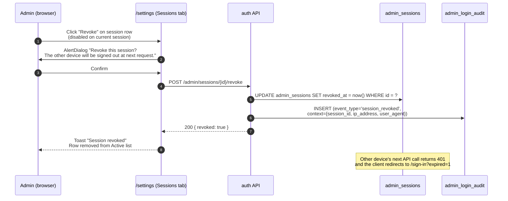
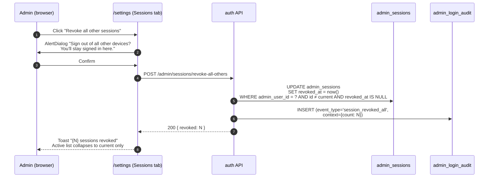

# Admin session revocation flow

How an admin revokes their own active sessions from `/settings` Sessions tab. Covers the per-row revoke and the "Revoke all other sessions" variants. The current session is intentionally not self-revocable from this surface — the admin must use the TopBar **Sign out** for that (the destination is the same `signOut({ reason: 'user' })` codepath, but the entry point is separate so the UI never asks the admin to confirm signing themselves out from within Settings).

## Sequence — single-session revoke

## Sequence — revoke all other sessions

## Cross-tab behaviour (mock — sessionStorage)

The prototype uses `sessionStorage` per tab, so cross-tab revocation in the demo is illustrative only. In production:

- A revoked session's `revoked_at` is checked server-side on every authenticated request.
- A revoked browser session sees its next API call return `401 SESSION_REVOKED` and is redirected to `/sign-in?expired=1&next=<here>` (same banner copy as idle-timeout).

## Forbidden in this UI

- **Self-revocation of the current session** from Sessions tab. The Revoke button is disabled on the row marked "This device". Use TopBar Sign out instead — semantically equivalent, but lives at the global chrome level (not buried in a tab).
- **Reason note.** Self-revocation is non-destructive (the admin is signing out of their own other devices); a reason note would be friction without forensic value. Compare with **password change** — also non-reasoned, since the actor is rotating their own credential. Forensic context is captured in `admin_login_audit.context` (session_id, ip_address, user_agent for single revoke; count for revoke-all).
- **Bulk select-and-revoke.** Two single buttons + one "all" CTA cover every realistic case; a checkbox column would be over-engineering.

## Cross-references

- Audit shape: [`models.md §10.9`](../models.md#109-settings-audit-events)
- Session table fields: [`models.md §10.3`](../models.md#103-field-reference--admin_sessions)
- Session lifecycle (active → idle → expired | revoked): [`admin_session_state_machine.md`](./admin_session_state_machine.md)
- Sign-in audit (parallel forensic stream): [`admin_signin_flow.md`](./admin_signin_flow.md)
