# Admin Session State Machine

> Canonical lifecycle of an `admin_sessions` row. Once an admin completes the sign-in + 2FA flow, a session row is created and drives every subsequent authenticated dashboard request until it expires, idles out, or is revoked.
>
> **Used in:** PRD §13 (Admin sign-in & 2FA)
> **Related:** [models.md §10.3](../models.md#103-field-reference--admin_sessions) · [admin_signin_flow.md](./admin_signin_flow.md)

```mermaid
stateDiagram-v2
  [*] --> active : sign-in flow completes (2FA verified or first-time setup confirmed)

  active --> idle : last_seen_at not bumped for ≥ 30 min<br/>(client idle timer fires; server validates)
  idle --> active : authenticated request bumps last_seen_at

  active --> expired : now() ≥ expires_at<br/>(absolute, default 12h after creation)
  idle --> expired : now() ≥ expires_at

  active --> revoked : explicit signout · password change · role change · super-admin force-revoke
  idle --> revoked : same as above

  expired --> [*] : server reaper deletes row 30d after expires_at
  revoked --> [*] : server reaper deletes row 30d after revoked_at
```

## State semantics

| state | `revoked_at` | clock test | client behavior |
|---|---|---|---|
| `active` | NULL | `now() < expires_at` AND `(now() - last_seen_at) < 30min` | normal dashboard access |
| `idle` | NULL | `now() < expires_at` AND `(now() - last_seen_at) ≥ 30min` | client redirects to `/sign-in?expired=1&next=<path>` |
| `expired` | NULL | `now() ≥ expires_at` | server returns 401; client redirects to `/sign-in?expired=1&next=<path>` |
| `revoked` | not NULL | irrelevant | server returns 401; client redirects to `/sign-in?next=<path>` (no expired banner — they signed out themselves OR their access was revoked) |

`idle` is **not** a persisted column — it's a derived view of (`last_seen_at`, `expires_at`, `revoked_at`). The server materializes the state per-request; the client maintains its own idle timer that fires the redirect proactively.

## Transition triggers

| transition | trigger |
|---|---|
| `[*] → active` | `POST /auth/2fa/verify` succeeds OR `POST /auth/2fa/setup/confirm` followed by backup-codes acknowledgement; `INSERT admin_sessions` |
| `active → idle` | client idle timer (30 min default; configurable) fires without intervening activity |
| `idle → active` | any authenticated request bumps `last_seen_at = now()` |
| `* → expired` | wall clock crosses `expires_at` (default `created_at + 12h`) |
| `* → revoked` | `POST /auth/signout` · password change · role change · super-admin revocation; sets `revoked_at = now()` |
| `expired → [*]` | nightly reaper job deletes rows where `expires_at < now() - 30d` |
| `revoked → [*]` | same reaper, applied to `revoked_at < now() - 30d` |

## UI mapping

| state observed by client | UI |
|---|---|
| `active` | full dashboard; TopBar shows admin display_name + role chip |
| `idle` (client-detected before server confirms) | navigate to `/sign-in?expired=1&next=<current_path>` — `<SessionExpiredBanner>` renders above the auth card |
| `expired` (server returns 401) | same as idle — banner reads "Session expired. Sign in again to continue." |
| `revoked` (server returns 401 with revoked-marker) | navigate to `/sign-in?next=<current_path>` — **no** expired banner |

## Audit hooks

Every transition that the server initiates writes one `admin_login_audit` row:

| transition | event_type |
|---|---|
| `[*] → active` (sign-in success) | `signin_success` |
| `active → revoked` (explicit signout) | `signout` |
| `* → expired` (server reaper or 401) | `session_expired` (one row per session, idempotent) |
| `* → revoked` (force-revoke / password change) | (logged via the originating action's audit, not session-level) |

## Configuration knobs

| knob | default | range |
|---|---|---|
| absolute session lifetime (`expires_at - created_at`) | 12h | 1h – 24h, super-admin configurable |
| idle timeout | 30 min | 5 min – 4h, super-admin configurable |
| reaper retention after `expires_at` / `revoked_at` | 30d | regulatory; do not shorten without compliance sign-off |

## Cross-references

- Sign-in flow that produces the initial `[*] → active` transition: [`admin_signin_flow.md`](./admin_signin_flow.md)
- Schema fields: [`models.md §10.3`](../models.md#103-field-reference--admin_sessions)
- Rate-limiting (which can cause an active session to be pre-emptively revoked under burst-attack conditions): [`models.md §10.6`](../models.md#106-rate-limiting-rules)
