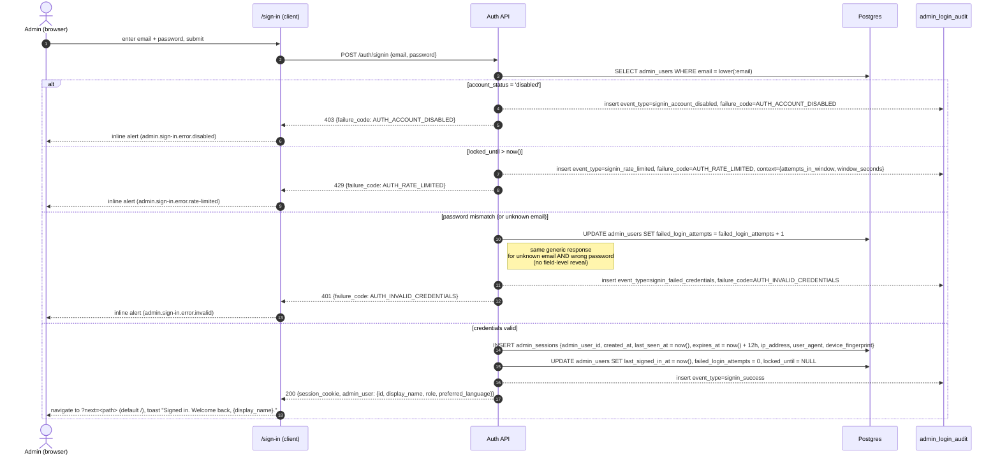
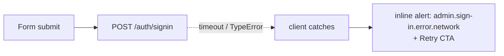
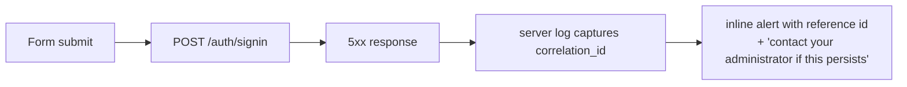

# Admin Sign-in Flow

> Canonical end-to-end sequence for an admin authenticating into the dashboard at `/sign-in`. Email + password only — there is no 2FA / OTP step on the admin surface (TOTP / SMS-OTP belongs to the mobile end-user flow). Covers the rate-limit, disabled-account, network, and 5xx failure paths.
>
> **Used in:** PRD §6.1 row 14 (Admin sign-in)
> **Related:** [models.md §10](../models.md#10-admin--auth) · [admin_session_state_machine.md](./admin_session_state_machine.md)

## Sequence

## Failure-only sub-paths

### Network failure (client → API unreachable)

No audit row is written — the request never reached the server.

### Backend 5xx

The audit row is the server's responsibility (request reached the server). The client surfaces the correlation id only.

## Rate-limit windows

See [models.md §10.6](../models.md#106-rate-limiting-rules) for the canonical thresholds:

- per email: 5 failed credentials in 15 min → `locked_until = now() + 15min`
- per IP: 20 failed attempts in 15 min → IP-level reject for the rest of the window

## State after success

The new `admin_sessions` row drives every subsequent authenticated request. See [`admin_session_state_machine.md`](./admin_session_state_machine.md) for the session lifecycle.
