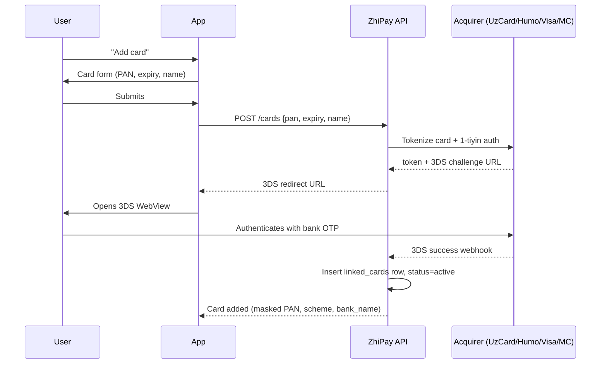

# Card Linking Flow

> Sequence diagram for adding a payment card. Tokenizes the PAN at the acquirer, runs a 1-tiyin authorization to validate, and completes a 3DS challenge before the card becomes usable.
>
> **Used in:** PRD §7.2 — Linking a card
>
> **Participants:**
> - **U** — User
> - **App** — ZhiPay mobile app
> - **API** — ZhiPay backend
> - **Acq** — Acquirer (UzCard / Humo / Visa / Mastercard processor)

