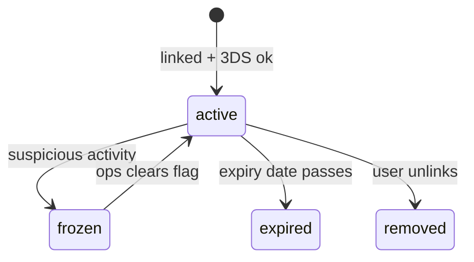

# Card State Machine

> Lifecycle of a `linked_cards` row. `frozen` is reachable from `active` via ops/AML action and back via clearance.
>
> **Used in:** PRD §8.3 — Card

```mermaid
stateDiagram-v2
  [*] --> active : linked + 3DS ok
  active --> frozen : suspicious activity
  active --> expired : expiry date passes
  active --> removed : user unlinks
  frozen --> active : ops clears flag
```
