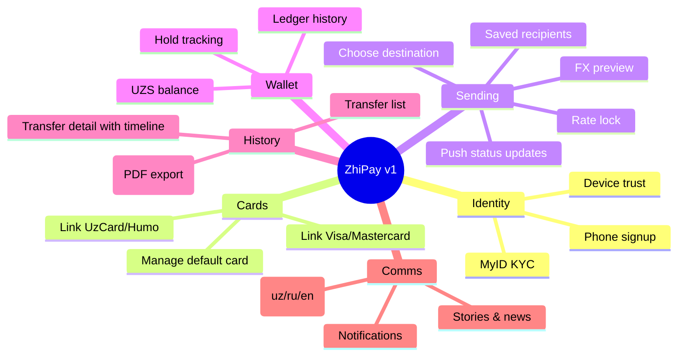

# Feature Overview Mindmap

> ZhiPay v1 feature surface, grouped into six top-level domains.
>
> **Used in:** PRD §6 — Core features

```mermaid
mindmap
  root((ZhiPay v1))
    Identity
      Phone signup
      MyID KYC
      Device trust
    Cards
      Link UzCard/Humo
      Link Visa/Mastercard
      Manage default card
    Sending
      Choose destination
      Saved recipients
      FX preview
      Rate lock
      Push status updates
    Wallet
      UZS balance
      Hold tracking
      Ledger history
    History
      Transfer list
      Transfer detail with timeline
      Receipts (PDF export)
    Comms
      Multi-language UI (uz/ru/en)
      Notifications
      Stories & news
```
