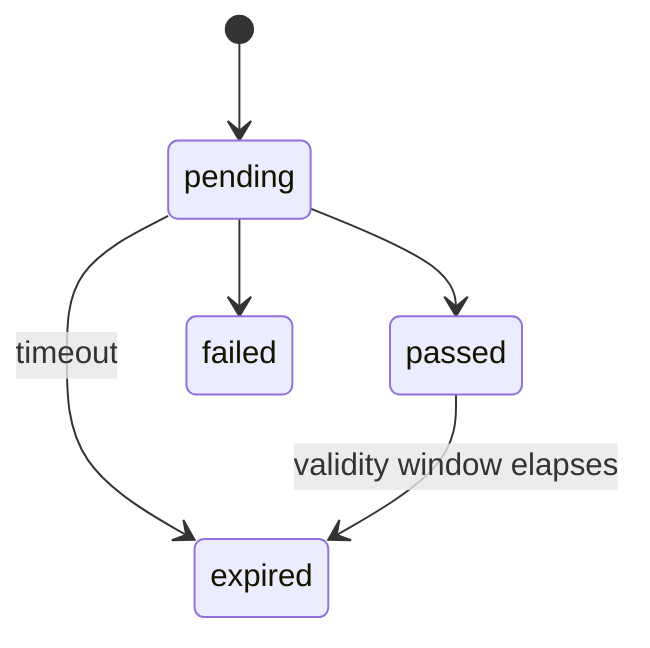

# KYC State Machine

> Lifecycle of a `kyc_verifications` row from MyID session start to terminal outcome. `expired` covers both abandoned sessions and exceeded validity windows.
>
> **Used in:** PRD §8.2 — KYC
> **Related:** [models.md §2.5](../models.md#25-kyc-state-machine)

