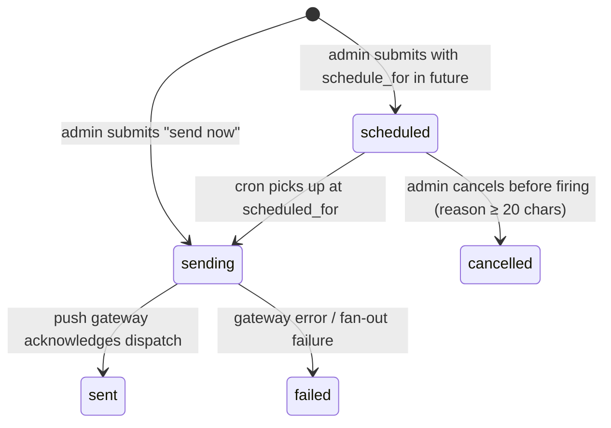

# Notification Send State Machine

> Canonical lifecycle of a `notifications` row authored via the admin composer at `/content/notifications`. Every transition writes an audit row tagged `entity_type = notification`.
>
> **Used in:** PRD §6 (Admin push notification composer)
> **Related:** [models.md §7](../models.md#7-errors--notifications)

## Terminal states

`sent`, `failed`, `cancelled` are terminal — push notifications cannot be retracted on user devices once dispatched. There is no transition from `failed` back to `sending`; a re-send is a new row with a new `id`.

## Audit verbs

| transition | audit action |
|---|---|
| `[*] → scheduled` | `schedule` |
| `[*] → sending` (immediate) | `send` |
| `scheduled → sending` | (cron, system actor — not admin-attributable) |
| `scheduled → cancelled` | `cancel_scheduled` |
| `sending → sent` | (system; recorded as a status flip on the same row) |
| `sending → failed` | (system; failure_code recorded in audit context) |

## UI mapping

| state | StatusChip tone | UI affordance |
|---|---|---|
| `scheduled` | accent (blue) | Detail page exposes "Cancel scheduled send" sticky-bottom button |
| `sending` | active (blue with motion) | Read-only — transient state, rarely seen in admin UI |
| `sent` | success (green) | Read-only — read-rate stats populated |
| `cancelled` | muted (gray) | Read-only — cancellation_reason visible on detail |
| `failed` | error (red) | Read-only — failure_code visible on detail |
