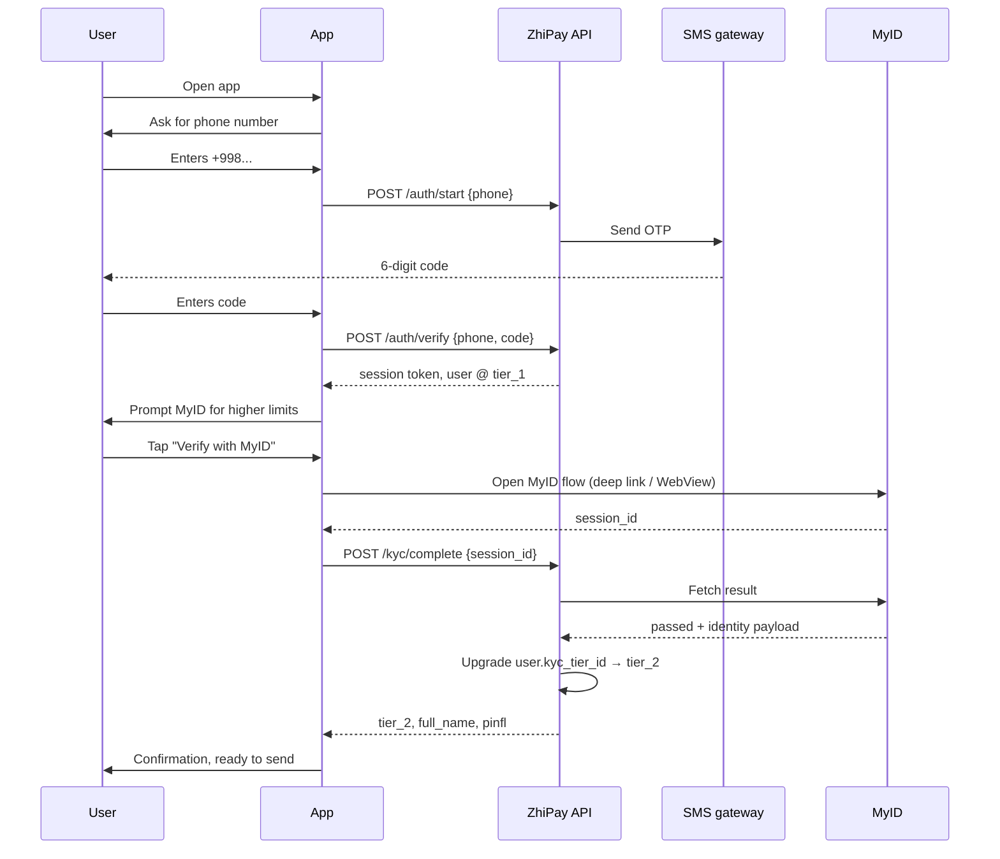

# Onboarding Flow — First-Time User

> Sequence diagram for first-time user onboarding: phone signup with SMS OTP, followed by an optional MyID KYC upgrade from `tier_1` → `tier_2`.
>
> **Used in:** PRD §7.1 — First-time onboarding
>
> **Participants:**
> - **U** — User
> - **App** — ZhiPay mobile app
> - **API** — ZhiPay backend
> - **SMS** — SMS gateway provider
> - **MyID** — Uzbekistan national e-ID service

