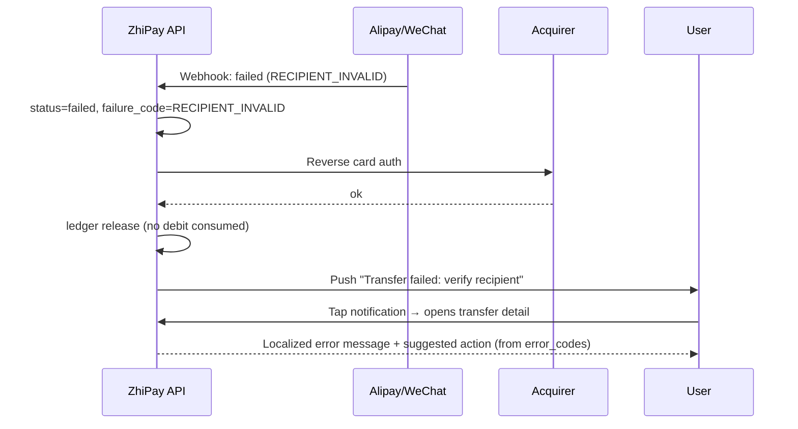

# Transfer Failure Recovery Flow

> Sequence diagram for a provider-side rejection (e.g. invalid Alipay/WeChat recipient). The card authorization is reversed, the wallet hold is released without consuming any limit, and the user is notified with a localized actionable error.
>
> **Used in:** PRD §7.4 — Failed transfer recovery
>
> **Participants:**
> - **API** — ZhiPay backend
> - **Prov** — Destination provider (Alipay or WeChat Pay)
> - **Acq** — Acquirer
> - **U** — User

