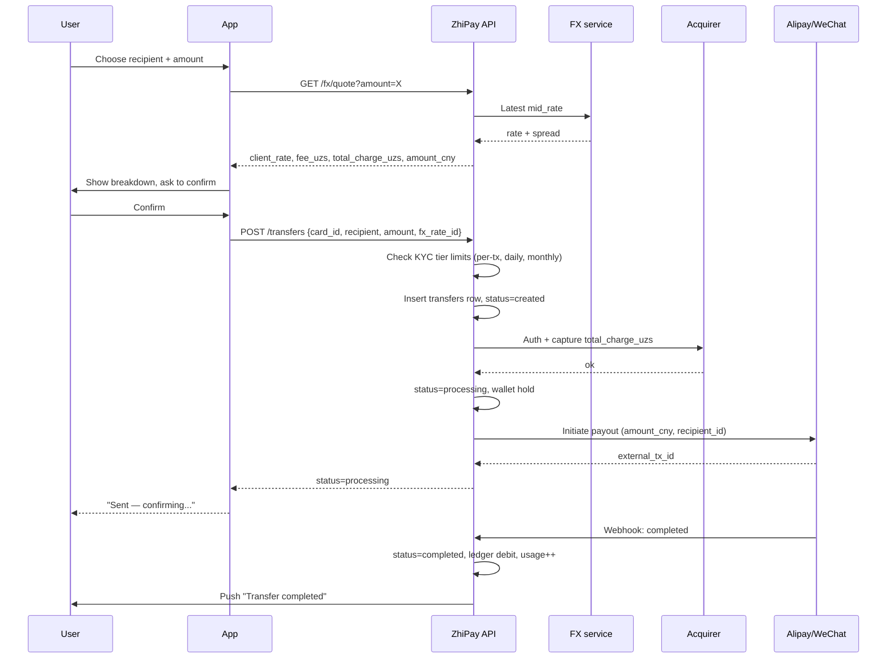

# Transfer Send Flow — Golden Path

> Sequence diagram for the happy-path transfer: FX quote, KYC tier limit check, card authorization, payout to Alipay/WeChat, and webhook-driven completion.
>
> **Used in:** PRD §7.3 — Send transfer (golden path)
>
> **Participants:**
> - **U** — User
> - **App** — ZhiPay mobile app
> - **API** — ZhiPay backend
> - **FX** — Internal FX rate service
> - **Acq** — Acquirer
> - **Prov** — Destination provider (Alipay or WeChat Pay)

