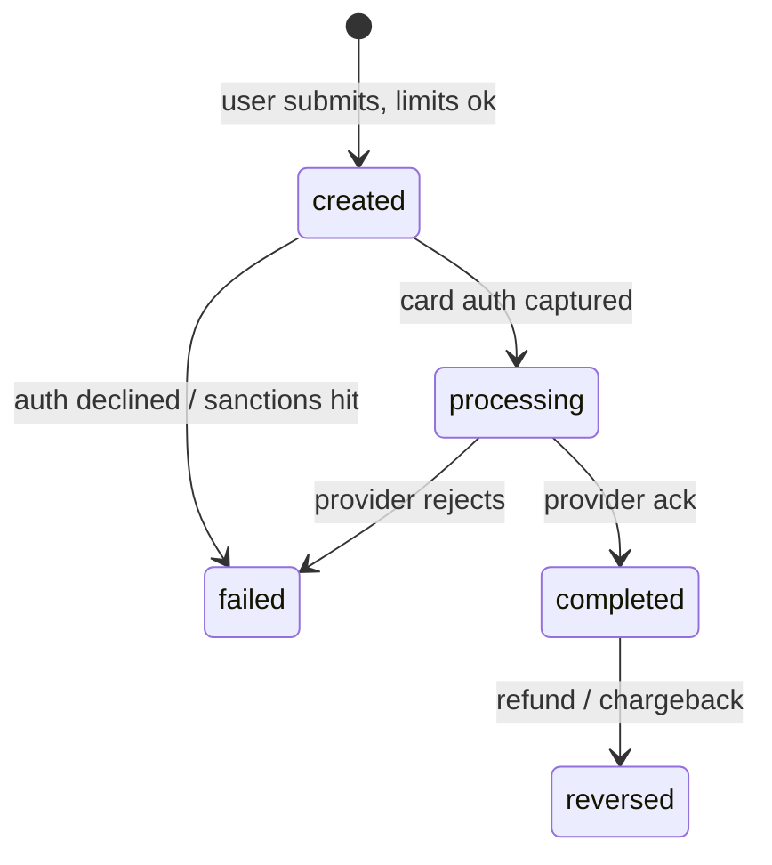

# Transfer State Machine

> Canonical lifecycle of a `transfers` row. Every transition writes a `transfer_events` audit row.
>
> **Used in:** PRD §8.1 — Transfer (canonical)
> **Related:** [models.md §4.2](../models.md#42-transfer-status-machine)

