# ZhiPay — Data Model Reference

Complete data model for the ZhiPay cross-border remittance platform (UZ → CN). Authoritative source for entity definitions, relationships, enums, and state machines.

> **Money convention:** all UZS amounts are stored in **tiyins** (`bigint`, 1 UZS = 100 tiyins). All CNY amounts are stored in **fen** (`bigint`, 1 CNY = 100 fen). Never use `float`/`double`/`real` for monetary values.
>
> **Identifier convention:** all primary keys are `uuid` (v7 preferred for index locality). All foreign keys use the same type as the referenced PK.
>
> **Timestamp convention:** all timestamps are `timestamptz` stored in UTC.

---

## 1. Domain Map

The schema is organized into seven domain groups. Arrows show ownership / dominant FK direction.

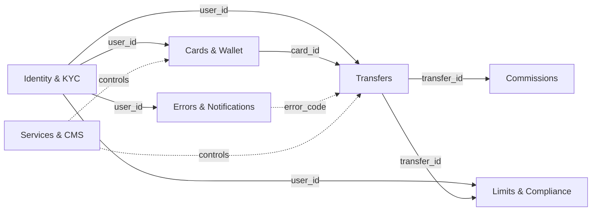

### High-level entity overview

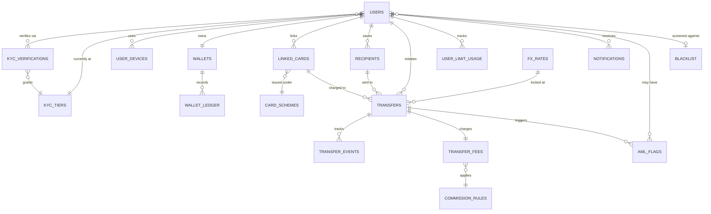

---

## 2. Identity & KYC

Core identity. Users register by phone, are verified via **MyID** (Uzbekistan's national e-ID), and the resulting **KYC tier** drives every transfer-limit decision downstream.

### 2.1 ER diagram

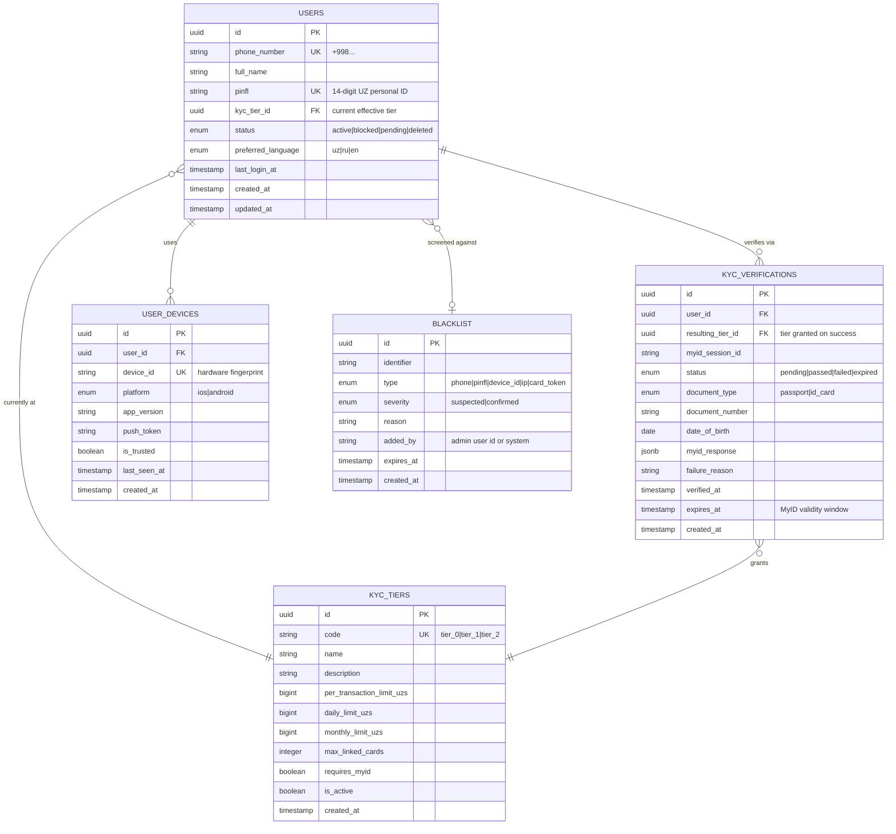

### 2.2 KYC tier definitions (canonical seed data)

| code     | name                | per-tx limit (UZS) | daily limit (UZS) | monthly limit (UZS) | max cards | requires MyID |
|----------|---------------------|-------------------:|------------------:|--------------------:|----------:|:--------------|
| `tier_0` | Unverified          | 0                  | 0                 | 0                   | 1         | no            |
| `tier_1` | Phone verified      | 5,000,000          | 5,000,000         | 20,000,000          | 2         | no            |
| `tier_2` | Fully MyID-verified | 50,000,000         | 50,000,000        | 200,000,000         | 5         | yes           |

> Limits are illustrative — final values must be set by Compliance and approved by CBU regulation.

### 2.3 Field reference — `users`

| field              | type         | constraints              | notes                                          |
|--------------------|--------------|--------------------------|------------------------------------------------|
| `id`               | uuid         | PK                       | uuid v7                                        |
| `phone_number`     | string       | unique, E.164            | login identifier                                |
| `full_name`        | string       | nullable until KYC       | sourced from MyID                               |
| `pinfl`            | string(14)   | unique, nullable         | UZ personal ID, only after MyID                 |
| `kyc_tier_id`      | uuid         | FK → `kyc_tiers.id`      | denormalized for fast limit lookup              |
| `status`           | enum         | not null                 | `active` / `blocked` / `pending` / `deleted`    |
| `preferred_language` | enum       | default `uz`             | drives notification content selection           |
| `last_login_at`    | timestamptz  | nullable                 | refreshed on session creation                   |
| `created_at`       | timestamptz  | not null, default now()  |                                                 |
| `updated_at`       | timestamptz  | not null                 | bumped via trigger                              |

### 2.4 Field reference — `kyc_verifications`

| field                  | type        | constraints                  | notes                                                       |
|------------------------|-------------|------------------------------|-------------------------------------------------------------|
| `id`                   | uuid        | PK                           |                                                             |
| `user_id`              | uuid        | FK → `users.id`              |                                                             |
| `resulting_tier_id`    | uuid        | FK → `kyc_tiers.id`, null    | populated on `passed`                                       |
| `myid_session_id`      | string      | unique, not null             | MyID-issued correlation id                                   |
| `status`               | enum        | not null                     | `pending` → `passed` / `failed` / `expired`                  |
| `document_type`        | enum        | not null                     | `passport` / `id_card`                                       |
| `document_number`      | string      | not null                     | encrypted at rest                                            |
| `date_of_birth`        | date        |                              | sanity check — under-18 must fail                            |
| `myid_response`        | jsonb       |                              | full response for audit                                       |
| `failure_reason`       | string      | nullable                     | human-readable cause for `failed`                            |
| `verified_at`          | timestamptz | nullable                     | set when status becomes `passed`                             |
| `expires_at`           | timestamptz | nullable                     | MyID re-verification window (e.g. 1 year)                    |
| `created_at`           | timestamptz | not null                     |                                                             |

### 2.5 Field reference — `blacklist`

| field         | type        | constraints                                  | notes                                                                                              |
|---------------|-------------|----------------------------------------------|----------------------------------------------------------------------------------------------------|
| `id`          | uuid        | PK                                           | uuid v7                                                                                            |
| `identifier`  | string      | not null                                     | full value, masked at the UI layer per `type`                                                      |
| `type`        | enum        | not null                                     | `phone` / `pinfl` / `device_id` / `ip` / `card_token`                                              |
| `severity`    | enum        | not null, default `suspected`                | `suspected` (warning UI) / `confirmed` (danger UI)                                                  |
| `reason`      | string      | not null, ≥ 30 chars at insert               | required justification — surfaced verbatim on the detail page; old reasons preserved in audit-log  |
| `added_by`    | string      | not null                                     | admin user id, or literal `'system'` for automated additions                                       |
| `expires_at`  | timestamptz | nullable                                     | `null` = indefinite; UI renders "Never" / countdown / "Expired"                                    |
| `created_at`  | timestamptz | not null, default now()                      |                                                                                                    |

> Edits and removals are recorded in a separate audit-log table (or `transfer_events`-style sink) — the row itself is never silently rewritten. Hard-deletes leave an audit-log entry. Active vs expired is derived from `(expires_at IS NULL OR expires_at > now())`.

### 2.6 KYC state machine

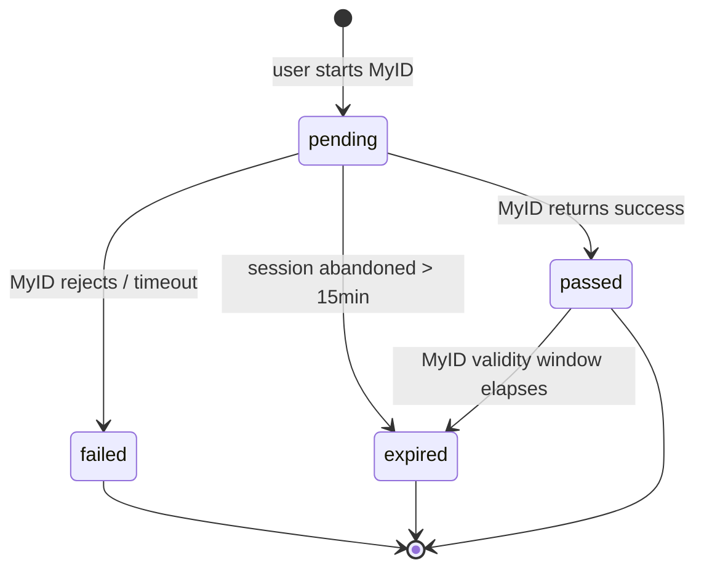

---

## 3. Cards & Wallet

Linked card scheme is normalized into `card_schemes`, supporting **UzCard, Humo, Visa, Mastercard**. The internal `wallet` keeps a UZS balance with a strict double-entry-style **ledger** for auditability.

### 3.1 ER diagram

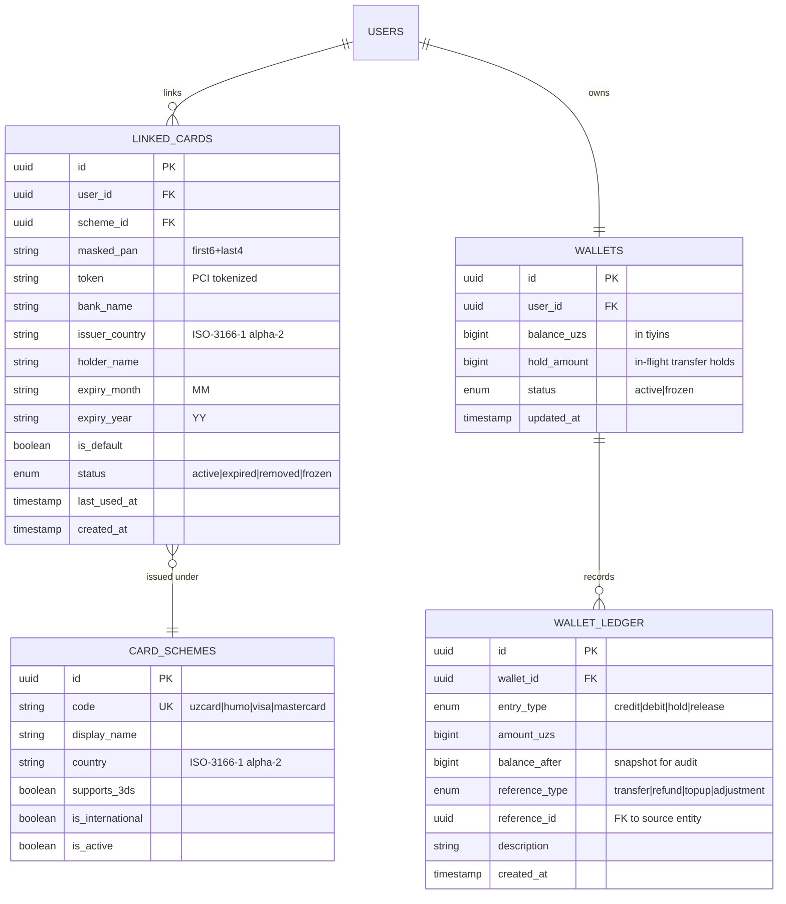

### 3.2 Card schemes (canonical seed data)

| code         | display name | country | supports_3ds | international |
|--------------|--------------|---------|:-------------|:--------------|
| `uzcard`     | UzCard       | UZ      | yes          | no            |
| `humo`       | Humo         | UZ      | yes          | no            |
| `visa`       | Visa         | US      | yes          | yes           |
| `mastercard` | Mastercard   | US      | yes          | yes           |

> International cards (`is_international = true`) may have different FX, fee, and limit treatment — see PRD §6.

### 3.3 Wallet ledger semantics

Every change to `wallets.balance_uzs` or `wallets.hold_amount` **must** produce a `wallet_ledger` row.

| entry_type | effect on balance | effect on hold | when                                     |
|------------|------------------:|---------------:|------------------------------------------|
| `hold`     | 0                 | +amount        | transfer enters `processing`              |
| `release`  | 0                 | −amount        | transfer fails, hold returned             |
| `debit`    | −amount           | −amount        | transfer completes (hold → real debit)    |
| `credit`   | +amount           | 0              | refund / reversal / topup                 |

`balance_after` snapshots `balance_uzs` post-write; reconciliation jobs compare ledger sums against the live balance.

---

## 4. Transfers

A transfer is the unit of cross-border send. The FX rate is **locked at creation**, the status machine is auditable via `transfer_events`, and recipients can be saved per-user for one-tap re-send.

### 4.1 ER diagram

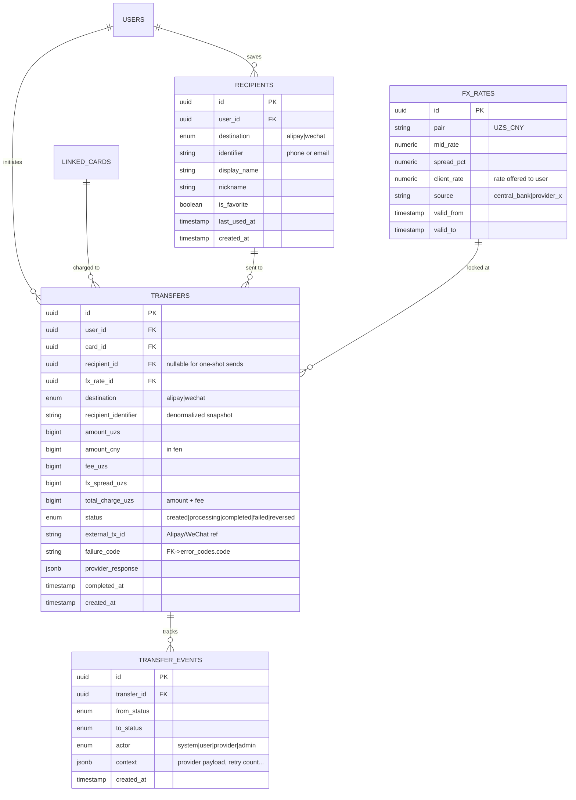

### 4.2 Transfer status machine

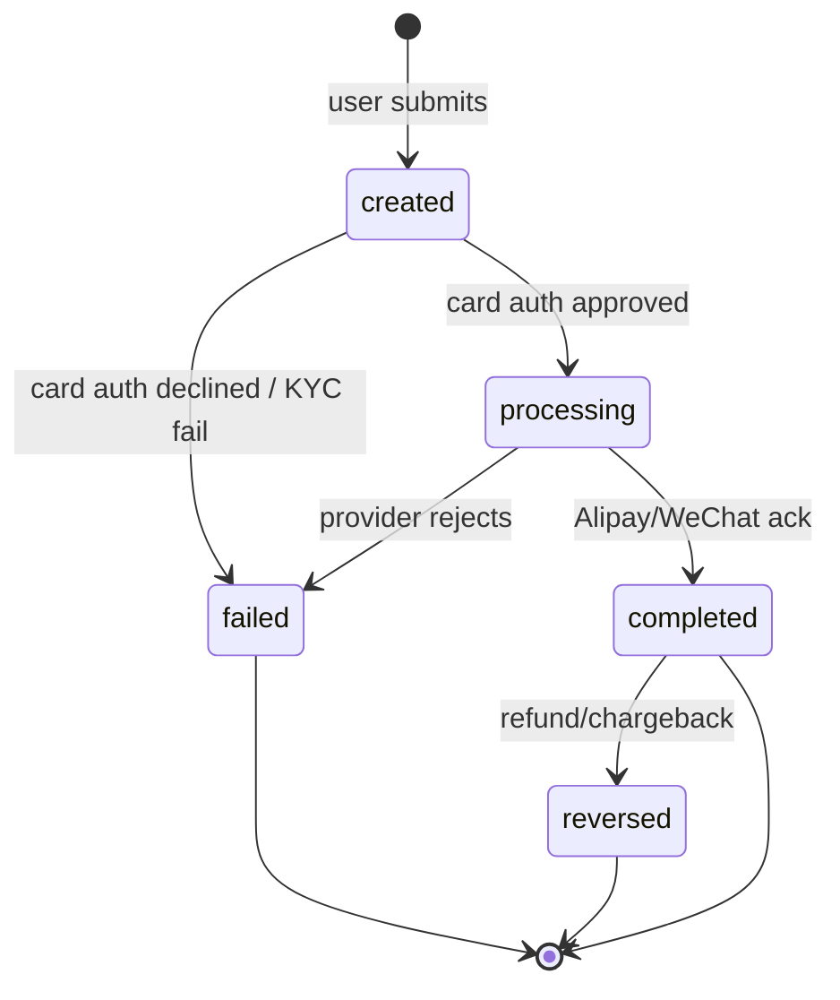

Every transition writes a `transfer_events` row (`from_status` → `to_status`) so the full lifecycle is reconstructible without depending on log retention.

### 4.3 FX rate lock invariant

- A `transfer` row's `fx_rate_id` MUST point to an `fx_rates` row whose `[valid_from, valid_to]` window contains `transfer.created_at`.
- Once `transfer.status = processing`, the linked rate is **immutable** for that transfer — never recompute CNY amount mid-flight.
- `amount_cny = floor(amount_uzs × client_rate)` — flooring prevents over-credit on rounding.

---

## 5. Limits & Compliance

Per-user usage rolls up daily/monthly to enforce KYC-tier caps cheaply at transfer creation. AML flags hang off both users and transfers for compliance review.

### 5.1 ER diagram

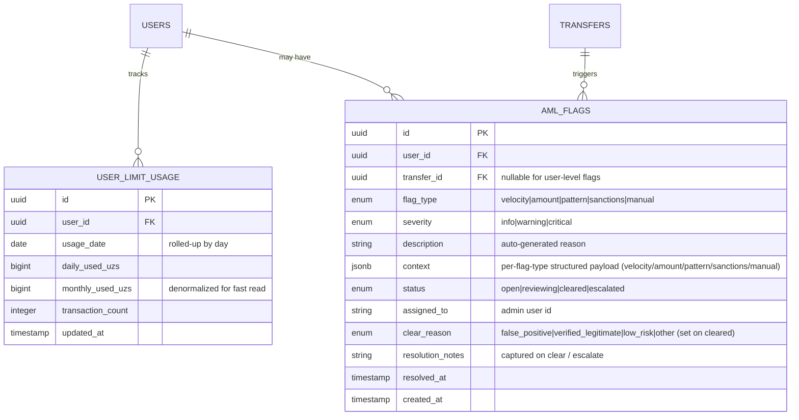

### 5.2 Limit enforcement read path

At transfer creation:

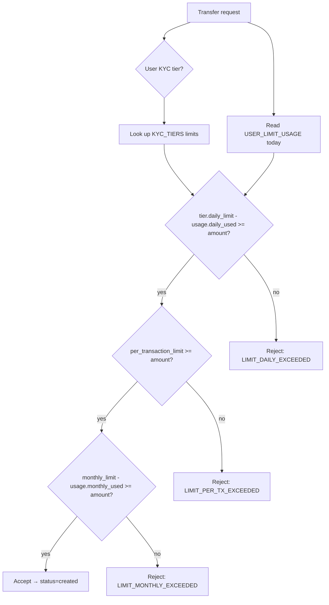

`USER_LIMIT_USAGE` is updated **only when status transitions to `completed`** — failed transfers do not consume limit.

---

## 6. Commissions

Versioned commission rules. Each `transfer_fees` row freezes which `commission_rules` version applied, so re-pricing history is auditable.

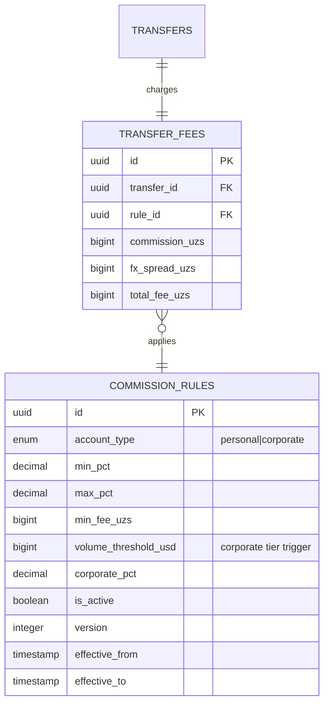

> Only **one** `commission_rules` row per `account_type` should have `is_active = true` AND `effective_from <= now() < effective_to`. Enforce via partial unique index.

---

## 7. Errors & Notifications

`error_codes` is the single source of truth for user-facing failure messages. `notifications` powers in-app, push, and broadcast comms with full UZ/RU/EN localization.

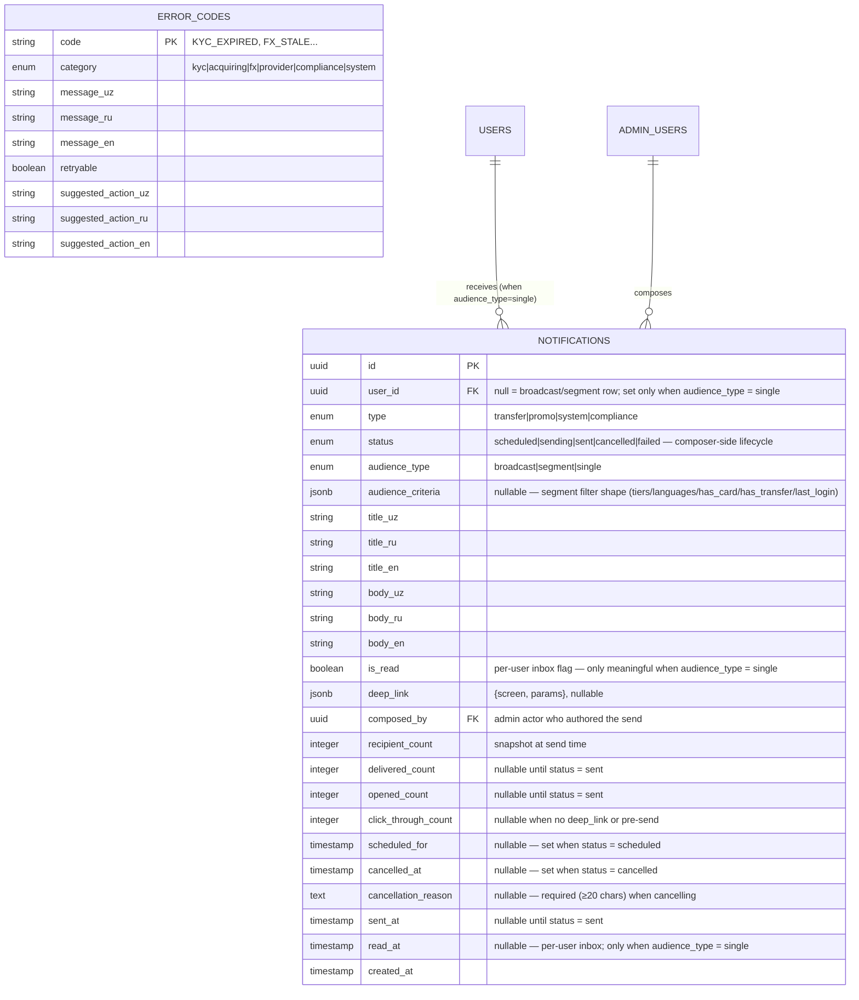

**Lifecycle:** see [`docs/mermaid_schemas/notification_send_state_machine.md`](./mermaid_schemas/notification_send_state_machine.md). Terminal states (`sent`, `failed`, `cancelled`) are immutable — push notifications cannot be retracted on user devices once dispatched.

**Audience semantics:**
- `audience_type = broadcast` → `user_id IS NULL`, `audience_criteria IS NULL`. Targets every active user at send time.
- `audience_type = segment` → `user_id IS NULL`, `audience_criteria` carries the filter (e.g. `{tiers: ['tier_1','tier_2'], languages: ['uz'], hasLinkedCard: true, lastLogin: 'lt30d'}`). Recipient set frozen at send time via `recipient_count` snapshot.
- `audience_type = single` → `user_id IS NOT NULL`, `audience_criteria IS NULL`. Per-user transactional notification (transfer status, KYC reminder, etc.). `is_read` / `read_at` are meaningful here only.

### 7.1 Error code examples

The seed expands to **15 codes** in v1 (admin Error Codes catalog at `/system/error-codes`). Listed below, sorted alphabetically:

| code                       | category   | retryable | suggested action (en, summary)                  |
|----------------------------|------------|:---------:|--------------------------------------------------|
| `3DS_TIMEOUT`              | acquiring  | yes       | Try again; check phone if bank app didn't open   |
| `CARD_DECLINED`            | acquiring  | yes       | Try a different card or contact bank             |
| `CARD_EXPIRED`             | acquiring  | no        | Add a new card                                   |
| `FX_STALE`                 | fx         | yes       | Refresh quote and review the new rate            |
| `INSUFFICIENT_FUNDS`       | acquiring  | yes       | Top up card or use another card                  |
| `KYC_EXPIRED`              | kyc        | no        | Re-verify with MyID                              |
| `KYC_REQUIRED`             | kyc        | no        | Verify with MyID                                 |
| `LIMIT_DAILY_EXCEEDED`     | compliance | no        | Wait until tomorrow or upgrade tier              |
| `LIMIT_MONTHLY_EXCEEDED`   | compliance | no        | Wait for next month or upgrade tier              |
| `LIMIT_PER_TX_EXCEEDED`    | compliance | no        | Split the transfer or upgrade tier               |
| `PROVIDER_UNAVAILABLE`     | provider   | yes       | Try again in a few minutes                       |
| `RECIPIENT_INVALID`        | provider   | no        | Verify Alipay/WeChat handle and retry            |
| `SANCTIONS_HIT`            | compliance | no        | Calm review pattern; notify within 24h           |
| `SYSTEM_ERROR`             | system     | yes       | Try again; contact support if it persists        |
| `THREE_DS_FAILED`          | acquiring  | yes       | Try again or use a different card                |

> **Localization**: each row carries `message_{uz|ru|en}` + `suggested_action_{uz|ru|en}` per §7. The `suggested action` column above shows the English summary for reference — actual user-facing copy renders from the localized fields.

---

## 8. Services & CMS

Operational toggles for payment rails and content surfaces in the mobile app.

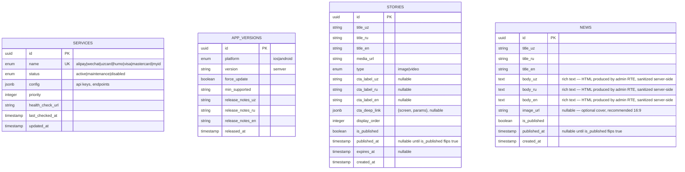

---

## 9. Cross-cutting concerns

### 9.1 Centralized enums

| enum                | values                                                                  | used in                                |
|---------------------|-------------------------------------------------------------------------|----------------------------------------|
| `user_status`       | `active`, `blocked`, `pending`, `deleted`                               | `users`                                |
| `kyc_status`        | `pending`, `passed`, `failed`, `expired`                                | `kyc_verifications`                    |
| `card_scheme_code`  | `uzcard`, `humo`, `visa`, `mastercard`                                  | `card_schemes`                         |
| `card_status`       | `active`, `expired`, `removed`, `frozen`                                | `linked_cards`                         |
| `wallet_status`     | `active`, `frozen`                                                      | `wallets`                              |
| `ledger_entry_type` | `credit`, `debit`, `hold`, `release`                                    | `wallet_ledger`                        |
| `transfer_status`   | `created`, `processing`, `completed`, `failed`, `reversed`              | `transfers`, `transfer_events`         |
| `transfer_destination` | `alipay`, `wechat`                                                   | `transfers`, `recipients`              |
| `notification_type` | `transfer`, `promo`, `system`, `compliance`                             | `notifications`                        |
| `notification_status` | `scheduled`, `sending`, `sent`, `cancelled`, `failed`                 | `notifications`                        |
| `notification_audience_type` | `broadcast`, `segment`, `single`                                | `notifications`                        |
| `aml_flag_type`     | `velocity`, `amount`, `pattern`, `sanctions`, `manual`                  | `aml_flags`                            |
| `aml_severity`      | `info`, `warning`, `critical`                                           | `aml_flags`                            |
| `language`          | `uz`, `ru`, `en`                                                        | `users.preferred_language`             |
| `platform`          | `ios`, `android`                                                        | `user_devices`, `app_versions`         |
| `admin_role`        | `super_admin`, `ops`, `compliance`, `finance`, `engineering`            | `admin_users`                          |
| `admin_account_status` | `active`, `disabled`, `pending`                                      | `admin_users`                          |
| `admin_login_event` | `signin_success`, `signin_failed_credentials`, `signin_rate_limited`, `signin_account_disabled`, `session_expired`, `signout`, `profile_changed`, `password_changed`, `session_revoked`, `session_revoked_all` | `admin_login_audit` |

### 9.2 Indexing recommendations

| table              | index                                                | rationale                                  |
|--------------------|------------------------------------------------------|--------------------------------------------|
| `users`            | `(phone_number)` UNIQUE                              | login lookup                                |
| `users`            | `(pinfl)` UNIQUE PARTIAL where pinfl is not null     | KYC dedup, Visa-only users may lack pinfl   |
| `linked_cards`     | `(user_id, status)` PARTIAL where status='active'    | "show my active cards" is the hot query     |
| `transfers`        | `(user_id, created_at DESC)`                         | history pagination                           |
| `transfers`        | `(status)` PARTIAL where status='processing'         | reconciliation worker scan                   |
| `transfer_events`  | `(transfer_id, created_at)`                          | timeline reconstruction                      |
| `user_limit_usage` | `(user_id, usage_date)` UNIQUE                       | upsert hot path                              |
| `aml_flags`        | `(status)` PARTIAL where status in ('open','reviewing')| ops queue                                  |
| `wallet_ledger`    | `(wallet_id, created_at DESC)`                       | balance reconstruction                       |
| `fx_rates`         | `(pair, valid_from DESC)`                            | "latest live rate" lookup                    |
| `stories`          | `(display_order)` UNIQUE PARTIAL where is_published=true | enforce unique slot among visible stories  |
| `stories`          | `(is_published, published_at DESC)`                  | "live carousel" + "scheduled queue" scans    |
| `news`             | `(is_published, published_at DESC NULLS LAST)`       | feed listing — published rows newest-first, drafts admin-only |
| `notifications`    | `(status, scheduled_for)` PARTIAL where status='scheduled' | cron picks up due-soon scheduled sends    |
| `notifications`    | `(status, sent_at DESC)` PARTIAL where status='sent'  | admin Sent tab listing — newest first      |
| `notifications`    | `(composed_by, sent_at DESC)`                         | per-admin audit-log filter                 |
| `notifications`    | `(user_id, sent_at DESC)` PARTIAL where user_id is not null | per-user inbox listing (mobile)      |
| `admin_users`      | `(email)` UNIQUE                                     | sign-in lookup                              |
| `admin_users`      | `(account_status)` PARTIAL where account_status='active' | active-roster scans                     |
| `admin_sessions`   | `(admin_user_id, expires_at DESC)`                   | "my active sessions" listing                |
| `admin_sessions`   | `(expires_at)` PARTIAL where revoked_at is null      | reaper sweeps for expired-but-not-revoked   |
| `admin_login_audit`| `(email_attempted, created_at DESC)`                 | rate-limit window scan + per-email forensics |
| `admin_login_audit`| `(ip_address, created_at DESC)`                      | per-IP rate-limit + forensics                |
| `admin_login_audit`| `(admin_user_id, created_at DESC)` PARTIAL where admin_user_id is not null | per-admin sign-in history    |

### 9.3 Money-handling rules

1. All monetary columns are `bigint` in **smallest currency unit** (tiyins for UZS, fen for CNY).
2. Conversions use `numeric(20,8)` for `fx_rates.client_rate`. Never widen to float.
3. Fee/spread arithmetic happens at integer level: `total_charge = amount + fee + spread` — all `bigint`.
4. Display layer formats with locale-appropriate separator; the database never stores formatted strings.

### 9.4 Soft-delete vs hard-delete

| entity              | strategy                            |
|---------------------|-------------------------------------|
| `users`             | soft (`status = 'deleted'`)         |
| `linked_cards`      | soft (`status = 'removed'`)         |
| `recipients`        | hard delete (no audit value)        |
| `transfers`         | never delete (regulatory retention) |
| `kyc_verifications` | never delete (regulatory retention) |
| `wallet_ledger`     | append-only, never delete           |
| `aml_flags`         | never delete (regulatory retention) |
| `admin_users`       | soft (`account_status = 'disabled'`) — never hard-deleted (audit chain depends on FK) |
| `admin_sessions`    | hard delete after retention window (30d after `expires_at`) |
| `admin_login_audit` | append-only, never delete (regulatory retention) |

---

## 10. Admin & Auth

Admin / ops / compliance / finance / engineering accounts that authenticate into the internal dashboard. **End-user accounts are in `users`** (§2) — `admin_users` is a separate identity space with its own auth, session, and audit tables.

> **No self-signup.** Admin accounts are provisioned out-of-band by an existing super-admin (or via an Anthropic-style invite-and-claim flow when one is built). The sign-in surface (`/sign-in`) only authenticates pre-provisioned accounts.
>
> **Email + password only.** The admin sign-in surface does NOT use 2FA / TOTP / SMS-OTP — those belong to the mobile end-user surface (phone OTP under the MyID flow, see §2). If 2FA is reintroduced for admin accounts later, this section will grow `totp_secret` / `backup_codes` columns and a separate setup flow; for now they are intentionally absent from the schema to keep the surface honest about what ships.
>
> **Passwords are never persisted.** `password_hash` is bcrypt/argon2 of the password — the plaintext password is never logged, never echoed in audit, never sent over a non-TLS channel.

### 10.1 ER diagram

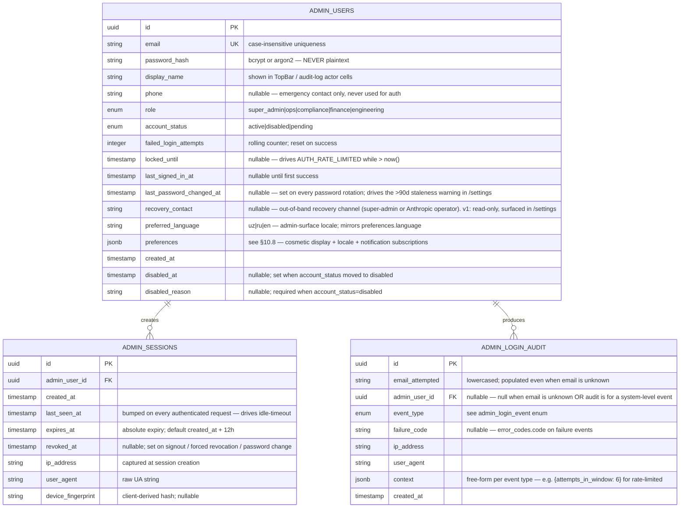

### 10.2 Field reference — `admin_users`

| field | semantic |
|---|---|
| `email` | Lowercase-canonical and unique. Sign-in form normalizes to lowercase before lookup. **Never editable from `/settings`** — the email is the credential identifier; rotation requires out-of-band reissue by a super-admin. |
| `password_hash` | argon2id (preferred) or bcrypt cost ≥ 12. The verifier rejects empty, NULL, or any value < 60 chars. |
| `phone` | Optional emergency contact (tel-format, normalized E.164). **NOT used for authentication** — the admin surface has no SMS-OTP path. Surfaced in `/settings` Profile tab; editable by the admin themselves. |
| `role` | Coarse-grained — fine-grained permissions live in a separate `admin_role_permissions` table not specified in this phase. **Never editable from `/settings`** — role transitions require out-of-band approval (super-admin can edit other admins' roles in a future admin-management surface; not in v1). |
| `account_status` | `active` = can sign in. `disabled` = sign-in returns `AUTH_ACCOUNT_DISABLED` regardless of password correctness. `pending` = invited but not yet claimed (future flow). |
| `failed_login_attempts` | Increments on `signin_failed_credentials`. Resets to 0 on `signin_success`. When ≥ threshold (5), `locked_until` is set to `now() + 15min`. |
| `locked_until` | When > `now()`, every sign-in attempt for this email returns `AUTH_RATE_LIMITED`. |
| `last_password_changed_at` | Set every time the admin rotates their password via `/settings` Security tab (or via out-of-band reset by a super-admin). Drives the "Last changed Nd ago" line in the Password card; ≥ 90 days surfaces in danger-tinted text as a soft staleness warning. |
| `recovery_contact` | Out-of-band recovery channel — super-admin email or Anthropic-operator handle. **Read-only in v1** — populated at provisioning time; the `/settings` Recovery card displays a calm "not available in v1, contact a super-admin out-of-band" message rather than offering a self-service edit. Future v1.1 may allow self-edit with confirmation. |
| `disabled_reason` | Required free-text when account_status flipped to disabled. Surfaces to the affected admin via support. |

### 10.3 Field reference — `admin_sessions`

| field | semantic |
|---|---|
| `expires_at` | Absolute expiry — even with continuous activity, the session is force-closed at this point. Default `created_at + 12h`. |
| `last_seen_at` | Updated on every authenticated request. Idle window = `now() - last_seen_at`. When idle > 30 min (configurable), the client redirects to `/sign-in?expired=1&next=<path>`. The server may also revoke server-side. |
| `revoked_at` | Set on explicit signout, password change, role change, or super-admin forced-revoke. Once set, the session is invalid regardless of `expires_at`. |

### 10.4 Field reference — `admin_login_audit`

Append-only. Every sign-in attempt — successful or failed, known-email or not — produces exactly one row. Powers per-email and per-IP rate limiting as well as forensic review.

| field | semantic |
|---|---|
| `email_attempted` | Lowercased, captured even when no `admin_users` row matches (so attacks against unknown emails are auditable). |
| `admin_user_id` | NULL when the email did not match a known account, OR when the event is a system-level signout / session-expiry. |
| `event_type` | One of `admin_login_event` enum values. |
| `failure_code` | Canonical short identifier for the failure cause. One of: `AUTH_INVALID_CREDENTIALS`, `AUTH_RATE_LIMITED`, `AUTH_ACCOUNT_DISABLED`, `AUTH_NETWORK`, `AUTH_SERVER_ERROR`. **These are intentionally NOT rows in the user-facing `error_codes` table** (§7) — auth errors are surface-scoped via `admin.sign-in.error.*` i18n keys per the security baseline (generic copy, no field-level reveal). The audit table uses these as opaque identifiers for forensics. |
| `context` | Per-event jsonb — e.g. for `signin_rate_limited`: `{attempts_in_window: 6, window_seconds: 900}`. **Never contains the password.** |

### 10.5 Sign-in flow & state machine

See [`mermaid_schemas/admin_signin_flow.md`](./mermaid_schemas/admin_signin_flow.md) for the sequence diagram and [`mermaid_schemas/admin_session_state_machine.md`](./mermaid_schemas/admin_session_state_machine.md) for session-state transitions.

### 10.6 Rate-limiting rules

| dimension | window | threshold | action |
|---|---|---:|---|
| per email | 15 min | 5 failed credentials attempts | `locked_until = now() + 15min`; subsequent attempts return `AUTH_RATE_LIMITED` |
| per IP | 15 min | 20 failed attempts (any email) | reject all sign-in attempts from this IP for the remainder of the window |

### 10.7 Privacy & security baseline

- **Generic credential errors.** The sign-in surface NEVER reveals whether an email is registered. `AUTH_INVALID_CREDENTIALS` is returned for both unknown email and wrong password — the form never says "user not found".
- **No password echo.** Audit `context` jsonb never contains the password. Verification happens at the API boundary; the value is discarded before the audit row is written.
- **Idle timeout is client + server.** Client-side idle timer fires the redirect; server-side also stamps `last_seen_at` and rejects expired sessions even if the client clock disagrees.
- **TLS-only.** Sign-in requests over plain HTTP are rejected at the edge; the surface assumes HTTPS and surfaces a `Secure` chip where confidence is needed.
- **Out-of-band password reset.** The "Forgot password?" affordance opens a modal directing the user to contact a super-admin — there is no self-service reset, by design (compliance posture).

### 10.8 `admin_users.preferences` jsonb shape

Cosmetic + locale + notification-subscription preferences for the `/settings` Preferences tab. Stored as a single jsonb column on `admin_users` (rather than a separate `admin_preferences` table) since rows are 1:1 with the admin and the schema is small.

```jsonc
{
  "theme": "light" | "dark" | "system",            // default: "system"
  "density": "compact" | "comfortable",            // default: "compact" (admin-density default)
  "language": "uz" | "ru" | "en",                  // mirrors admin_users.preferred_language
  "timezone": string,                               // IANA, e.g. "Asia/Tashkent" — default: browser-detected
  "date_format": "iso" | "eu" | "us",              // iso=2026-04-28 / eu=28.04.2026 / us=Apr 28, 2026
  "time_format": "12h" | "24h",                    // default per language (uz/ru → 24h; en → 12h)
  "tabular_numerals": boolean,                      // default: true
  "notification_subscriptions": {
    "aml_critical":     boolean,  // critical AML flag opened — default: true
    "sanctions_hit":    boolean,  // sanctions hit detected — default: true
    "service_offline":  boolean,  // a service goes offline — default: true (ops/eng), false otherwise
    "fx_stale":         boolean,  // FX rate goes stale — default: true (finance), false otherwise
    "daily_digest":     boolean,  // daily ops summary email — default: false
    "failed_signin":    boolean   // failed sign-in attempt against my account — default: true
  }
}
```

- **Theme + density apply live** — no save button; the Settings UI persists each change immediately and applies a CSS hook (`<html data-density="…">` + class on root) so the surface re-renders without a page reload.
- **Language is `en`-only in v1** (per the i18n stub state); `uz` and `ru` render as "Coming soon" pills in the radio group.
- **Date / time / timezone preferences are persisted in v1** but full rollout to date-formatting helpers across the app is staged — the Settings tab surfaces an inline note. Sessions tab + sign-in history table within Settings respect the prefs end-to-end as a contract demo.
- **Notification subscriptions** are persisted but the actual delivery wiring (email / push to admin) is out-of-scope for v1 — the toggles document intent only.
- **Preferences changes are NOT audited** (purely cosmetic; not security-relevant). All other Settings actions ARE audited — see §10.9.

### 10.9 `/settings` audit events

`/settings` actions write to **`admin_login_audit`** (not the central `mockAuditLog`) — preserving the Phase 20 separation between auth/identity events and entity-state-change events. Four new `admin_login_event` enum values cover the surface:

| event_type | written when | context jsonb shape |
|---|---|---|
| `profile_changed` | Admin edits `display_name` and/or `phone` from Profile tab. | `{ fields: ["display_name" \| "phone", ...], previous: {…}, reason: string (≥10 chars) }` |
| `password_changed` | Admin rotates their own password via Security tab → Change password. | `{ signed_out_other_sessions: number }` (count of other sessions revoked as a side-effect; `password_hash` and plaintext NEVER appear) |
| `session_revoked` | Admin revokes a single non-current session from Sessions tab. | `{ session_id: uuid, ip_address: string, user_agent: string }` |
| `session_revoked_all` | Admin revokes all non-current sessions via "Revoke all other sessions". | `{ count: number }` |

**Why not the central audit log?** Auth/identity events would drown the entity-state-change signal compliance reviewers are scanning for in `/compliance/audit-log`. The "My audit" tab inside `/settings` reads from the central log filtered by `actor.id = current admin id` — surfacing entity-state-change actions the admin took (KYC approvals, transfer reversals, FX edits, etc.). Auth events stay in their own forensic stream.
