# ZhiPay — Data Model Reference

Complete data model for the ZhiPay cross-border remittance platform (UZ → CN). Authoritative source for entity definitions, relationships, enums, and state machines.

> **Money convention:** all UZS amounts are stored in **tiyins** (`bigint`, 1 UZS = 100 tiyins). All CNY amounts are stored in **fen** (`bigint`, 1 CNY = 100 fen). Never use `float`/`double`/`real` for monetary values.
>
> **Identifier convention:** all primary keys are `uuid` (v7 preferred for index locality). All foreign keys use the same type as the referenced PK.
>
> **Timestamp convention:** all timestamps are `timestamptz` stored in UTC.

---

## 1. Domain Map

The schema is organized into seven domain groups. Arrows show ownership / dominant FK direction.

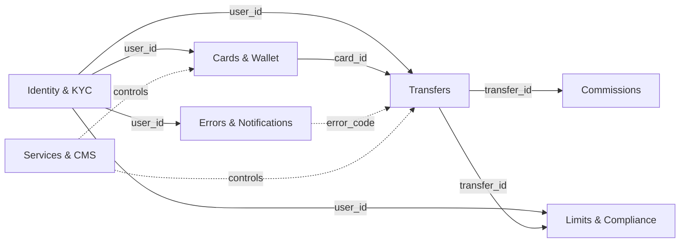

### High-level entity overview

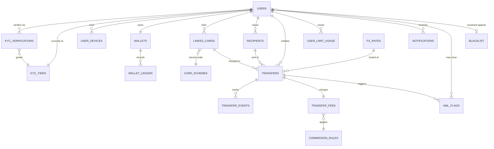

---

## 2. Identity & KYC

Core identity. Users register by phone, are verified via **MyID** (Uzbekistan's national e-ID), and the resulting **KYC tier** drives every transfer-limit decision downstream.

### 2.1 ER diagram

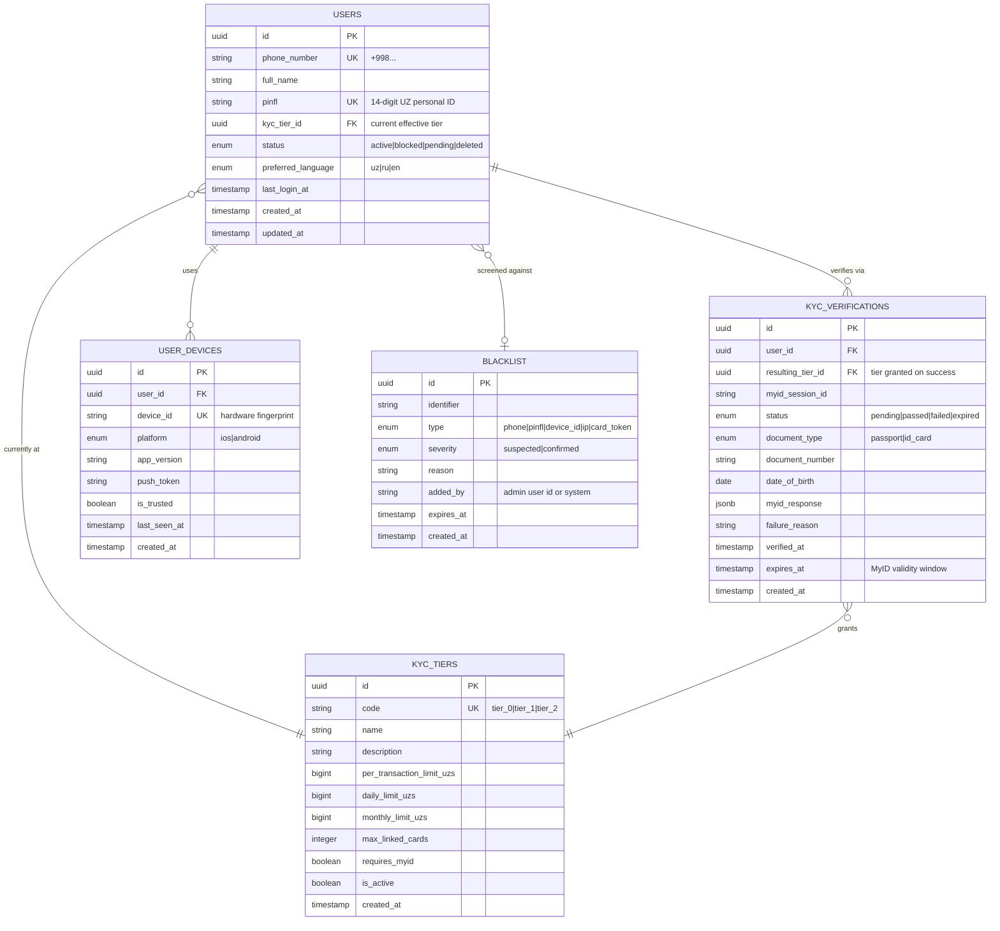

### 2.2 KYC tier definitions (canonical seed data)

| code     | name                | per-tx limit (UZS) | daily limit (UZS) | monthly limit (UZS) | max cards | requires MyID |
|----------|---------------------|-------------------:|------------------:|--------------------:|----------:|:--------------|
| `tier_0` | Unverified          | 0                  | 0                 | 0                   | 1         | no            |
| `tier_1` | Phone verified      | 5,000,000          | 5,000,000         | 20,000,000          | 2         | no            |
| `tier_2` | Fully MyID-verified | 50,000,000         | 50,000,000        | 200,000,000         | 5         | yes           |

> Limits are illustrative — final values must be set by Compliance and approved by CBU regulation.

### 2.3 Field reference — `users`

| field              | type         | constraints              | notes                                          |
|--------------------|--------------|--------------------------|------------------------------------------------|
| `id`               | uuid         | PK                       | uuid v7                                        |
| `phone_number`     | string       | unique, E.164            | login identifier                                |
| `full_name`        | string       | nullable until KYC       | sourced from MyID                               |
| `pinfl`            | string(14)   | unique, nullable         | UZ personal ID, only after MyID                 |
| `kyc_tier_id`      | uuid         | FK → `kyc_tiers.id`      | denormalized for fast limit lookup              |
| `status`           | enum         | not null                 | `active` / `blocked` / `pending` / `deleted`    |
| `preferred_language` | enum       | default `uz`             | drives notification content selection           |
| `last_login_at`    | timestamptz  | nullable                 | refreshed on session creation                   |
| `created_at`       | timestamptz  | not null, default now()  |                                                 |
| `updated_at`       | timestamptz  | not null                 | bumped via trigger                              |

### 2.4 Field reference — `kyc_verifications`

| field                  | type        | constraints                  | notes                                                       |
|------------------------|-------------|------------------------------|-------------------------------------------------------------|
| `id`                   | uuid        | PK                           |                                                             |
| `user_id`              | uuid        | FK → `users.id`              |                                                             |
| `resulting_tier_id`    | uuid        | FK → `kyc_tiers.id`, null    | populated on `passed`                                       |
| `myid_session_id`      | string      | unique, not null             | MyID-issued correlation id                                   |
| `status`               | enum        | not null                     | `pending` → `passed` / `failed` / `expired`                  |
| `document_type`        | enum        | not null                     | `passport` / `id_card`                                       |
| `document_number`      | string      | not null                     | encrypted at rest                                            |
| `date_of_birth`        | date        |                              | sanity check — under-18 must fail                            |
| `myid_response`        | jsonb       |                              | full response for audit                                       |
| `failure_reason`       | string      | nullable                     | human-readable cause for `failed`                            |
| `verified_at`          | timestamptz | nullable                     | set when status becomes `passed`                             |
| `expires_at`           | timestamptz | nullable                     | MyID re-verification window (e.g. 1 year)                    |
| `created_at`           | timestamptz | not null                     |                                                             |

### 2.5 Field reference — `blacklist`

| field         | type        | constraints                                  | notes                                                                                              |
|---------------|-------------|----------------------------------------------|----------------------------------------------------------------------------------------------------|
| `id`          | uuid        | PK                                           | uuid v7                                                                                            |
| `identifier`  | string      | not null                                     | full value, masked at the UI layer per `type`                                                      |
| `type`        | enum        | not null                                     | `phone` / `pinfl` / `device_id` / `ip` / `card_token`                                              |
| `severity`    | enum        | not null, default `suspected`                | `suspected` (warning UI) / `confirmed` (danger UI)                                                  |
| `reason`      | string      | not null, ≥ 30 chars at insert               | required justification — surfaced verbatim on the detail page; old reasons preserved in audit-log  |
| `added_by`    | string      | not null                                     | admin user id, or literal `'system'` for automated additions                                       |
| `expires_at`  | timestamptz | nullable                                     | `null` = indefinite; UI renders "Never" / countdown / "Expired"                                    |
| `created_at`  | timestamptz | not null, default now()                      |                                                                                                    |

> Edits and removals are recorded in a separate audit-log table (or `transfer_events`-style sink) — the row itself is never silently rewritten. Hard-deletes leave an audit-log entry. Active vs expired is derived from `(expires_at IS NULL OR expires_at > now())`.

### 2.6 KYC state machine

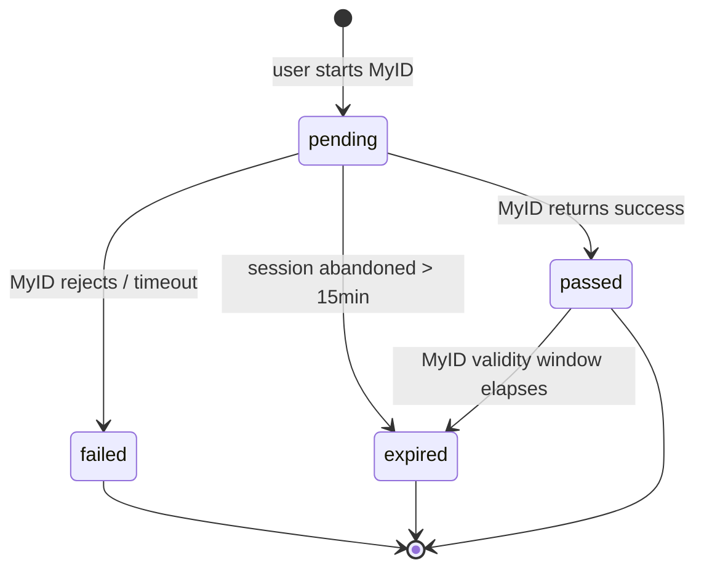

---

## 3. Cards & Wallet

Linked card scheme is normalized into `card_schemes`, supporting **UzCard, Humo, Visa, Mastercard**. The internal `wallet` keeps a UZS balance with a strict double-entry-style **ledger** for auditability.

### 3.1 ER diagram

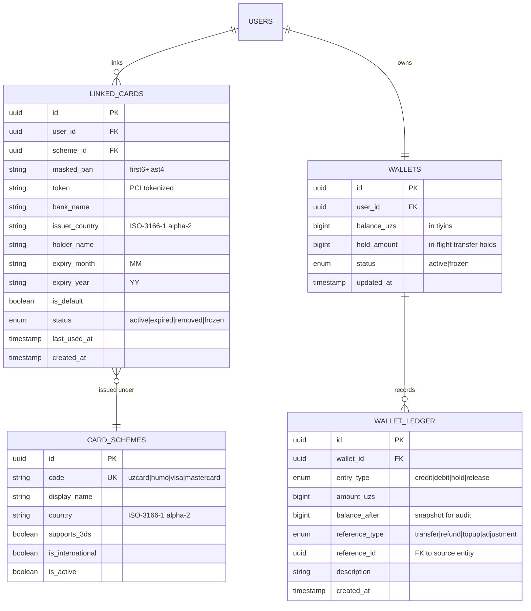

### 3.2 Card schemes (canonical seed data)

| code         | display name | country | supports_3ds | international |
|--------------|--------------|---------|:-------------|:--------------|
| `uzcard`     | UzCard       | UZ      | yes          | no            |
| `humo`       | Humo         | UZ      | yes          | no            |
| `visa`       | Visa         | US      | yes          | yes           |
| `mastercard` | Mastercard   | US      | yes          | yes           |

> International cards (`is_international = true`) may have different FX, fee, and limit treatment — see PRD §6.

### 3.3 Wallet ledger semantics

Every change to `wallets.balance_uzs` or `wallets.hold_amount` **must** produce a `wallet_ledger` row.

| entry_type | effect on balance | effect on hold | when                                     |
|------------|------------------:|---------------:|------------------------------------------|
| `hold`     | 0                 | +amount        | transfer enters `processing`              |
| `release`  | 0                 | −amount        | transfer fails, hold returned             |
| `debit`    | −amount           | −amount        | transfer completes (hold → real debit)    |
| `credit`   | +amount           | 0              | refund / reversal / topup                 |

`balance_after` snapshots `balance_uzs` post-write; reconciliation jobs compare ledger sums against the live balance.

---

## 4. Transfers

A transfer is the unit of cross-border send. The FX rate is **locked at creation**, the status machine is auditable via `transfer_events`, and recipients can be saved per-user for one-tap re-send.

### 4.1 ER diagram

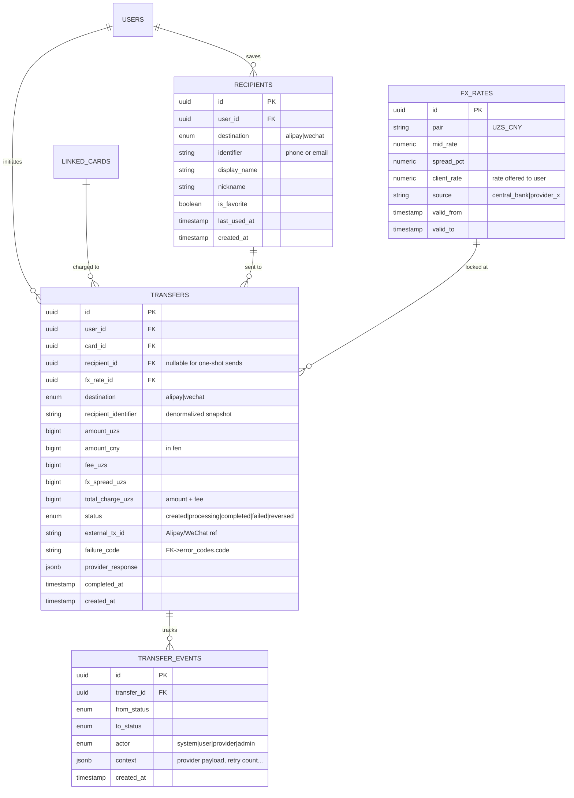

### 4.2 Transfer status machine

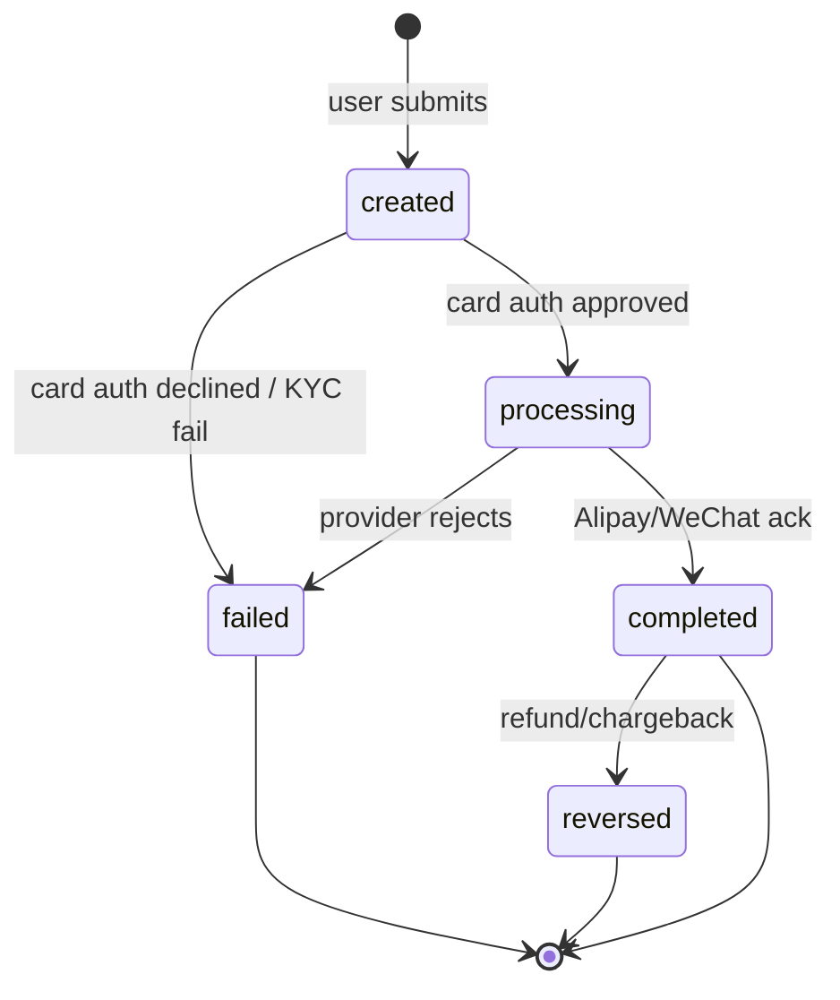

Every transition writes a `transfer_events` row (`from_status` → `to_status`) so the full lifecycle is reconstructible without depending on log retention.

### 4.3 FX rate lock invariant

- A `transfer` row's `fx_rate_id` MUST point to an `fx_rates` row whose `[valid_from, valid_to]` window contains `transfer.created_at`.
- Once `transfer.status = processing`, the linked rate is **immutable** for that transfer — never recompute CNY amount mid-flight.
- `amount_cny = floor(amount_uzs × client_rate)` — flooring prevents over-credit on rounding.

---

## 5. Limits & Compliance

Per-user usage rolls up daily/monthly to enforce KYC-tier caps cheaply at transfer creation. AML flags hang off both users and transfers for compliance review.

### 5.1 ER diagram

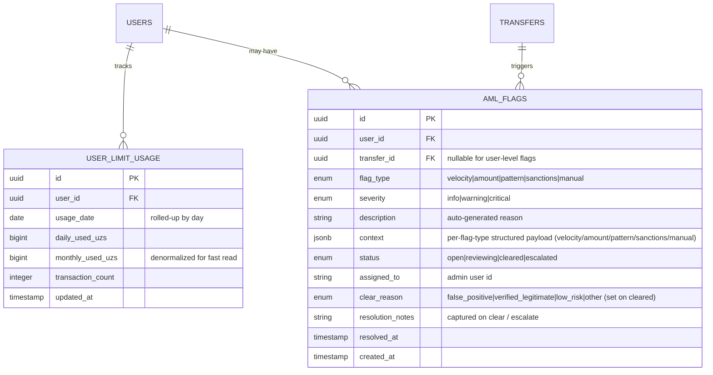

### 5.2 Limit enforcement read path

At transfer creation:

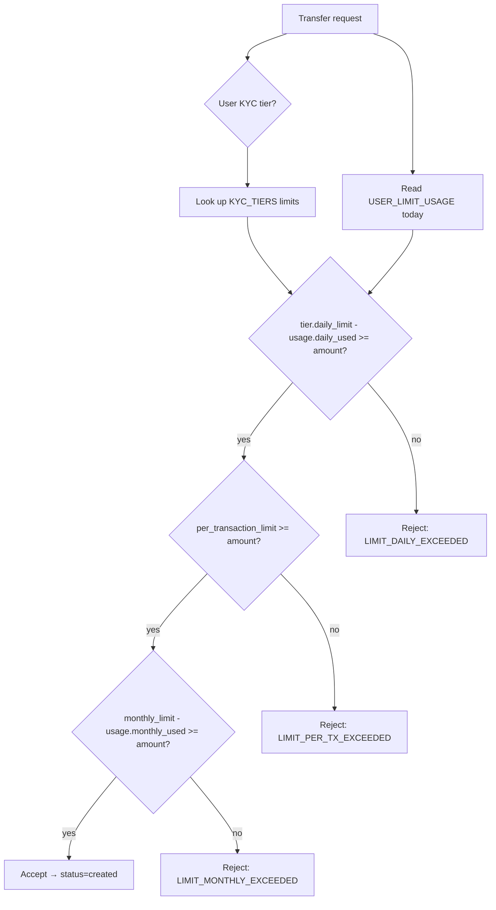

`USER_LIMIT_USAGE` is updated **only when status transitions to `completed`** — failed transfers do not consume limit.

---

## 6. Commissions

Versioned commission rules. Each `transfer_fees` row freezes which `commission_rules` version applied, so re-pricing history is auditable.

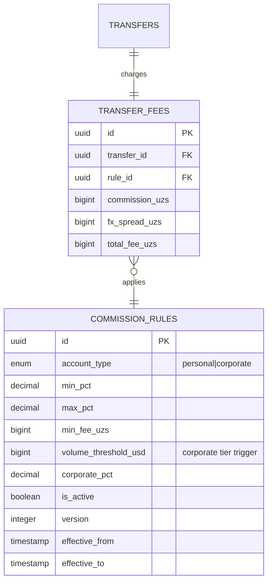

> Only **one** `commission_rules` row per `account_type` should have `is_active = true` AND `effective_from <= now() < effective_to`. Enforce via partial unique index.

---

## 7. Errors & Notifications

`error_codes` is the single source of truth for user-facing failure messages. `notifications` powers in-app, push, and broadcast comms with full UZ/RU/EN localization.

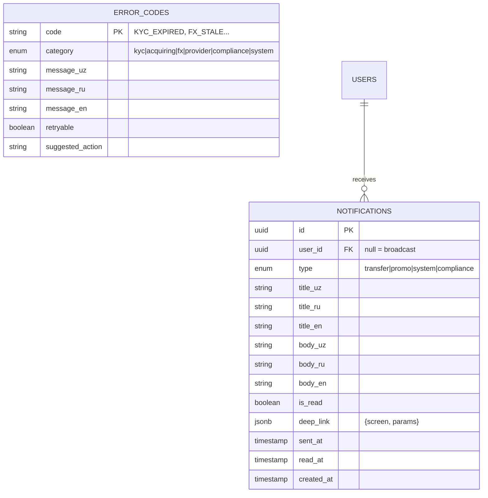

### 7.1 Error code examples

| code                    | category   | retryable | suggested action                          |
|-------------------------|------------|:---------:|--------------------------------------------|
| `KYC_REQUIRED`          | kyc        | no        | Prompt MyID flow                            |
| `KYC_EXPIRED`           | kyc        | no        | Re-run MyID                                 |
| `LIMIT_DAILY_EXCEEDED`  | compliance | no        | Suggest waiting or upgrading tier           |
| `LIMIT_PER_TX_EXCEEDED` | compliance | no        | Suggest splitting transfer                  |
| `CARD_DECLINED`         | acquiring  | yes       | Try another card / retry                    |
| `INSUFFICIENT_FUNDS`    | acquiring  | yes       | Top up card and retry                       |
| `FX_STALE`              | fx         | yes       | Refetch rate and retry                      |
| `PROVIDER_UNAVAILABLE`  | provider   | yes       | Backoff and retry                           |
| `RECIPIENT_INVALID`     | provider   | no        | Verify Alipay/WeChat handle                 |
| `SANCTIONS_HIT`         | compliance | no        | Escalate to manual review                   |

---

## 8. Services & CMS

Operational toggles for payment rails and content surfaces in the mobile app.

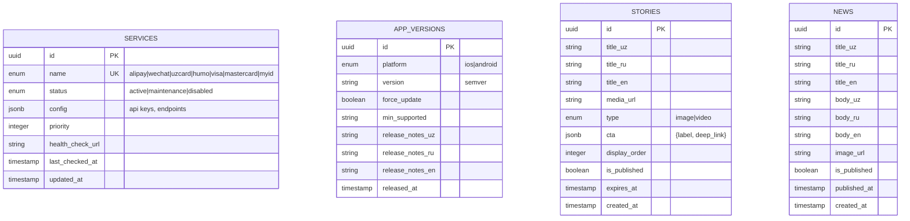

---

## 9. Cross-cutting concerns

### 9.1 Centralized enums

| enum                | values                                                                  | used in                                |
|---------------------|-------------------------------------------------------------------------|----------------------------------------|
| `user_status`       | `active`, `blocked`, `pending`, `deleted`                               | `users`                                |
| `kyc_status`        | `pending`, `passed`, `failed`, `expired`                                | `kyc_verifications`                    |
| `card_scheme_code`  | `uzcard`, `humo`, `visa`, `mastercard`                                  | `card_schemes`                         |
| `card_status`       | `active`, `expired`, `removed`, `frozen`                                | `linked_cards`                         |
| `wallet_status`     | `active`, `frozen`                                                      | `wallets`                              |
| `ledger_entry_type` | `credit`, `debit`, `hold`, `release`                                    | `wallet_ledger`                        |
| `transfer_status`   | `created`, `processing`, `completed`, `failed`, `reversed`              | `transfers`, `transfer_events`         |
| `transfer_destination` | `alipay`, `wechat`                                                   | `transfers`, `recipients`              |
| `notification_type` | `transfer`, `promo`, `system`, `compliance`                             | `notifications`                        |
| `aml_flag_type`     | `velocity`, `amount`, `pattern`, `sanctions`, `manual`                  | `aml_flags`                            |
| `aml_severity`      | `info`, `warning`, `critical`                                           | `aml_flags`                            |
| `language`          | `uz`, `ru`, `en`                                                        | `users.preferred_language`             |
| `platform`          | `ios`, `android`                                                        | `user_devices`, `app_versions`         |

### 9.2 Indexing recommendations

| table              | index                                                | rationale                                  |
|--------------------|------------------------------------------------------|--------------------------------------------|
| `users`            | `(phone_number)` UNIQUE                              | login lookup                                |
| `users`            | `(pinfl)` UNIQUE PARTIAL where pinfl is not null     | KYC dedup, Visa-only users may lack pinfl   |
| `linked_cards`     | `(user_id, status)` PARTIAL where status='active'    | "show my active cards" is the hot query     |
| `transfers`        | `(user_id, created_at DESC)`                         | history pagination                           |
| `transfers`        | `(status)` PARTIAL where status='processing'         | reconciliation worker scan                   |
| `transfer_events`  | `(transfer_id, created_at)`                          | timeline reconstruction                      |
| `user_limit_usage` | `(user_id, usage_date)` UNIQUE                       | upsert hot path                              |
| `aml_flags`        | `(status)` PARTIAL where status in ('open','reviewing')| ops queue                                  |
| `wallet_ledger`    | `(wallet_id, created_at DESC)`                       | balance reconstruction                       |
| `fx_rates`         | `(pair, valid_from DESC)`                            | "latest live rate" lookup                    |

### 9.3 Money-handling rules

1. All monetary columns are `bigint` in **smallest currency unit** (tiyins for UZS, fen for CNY).
2. Conversions use `numeric(20,8)` for `fx_rates.client_rate`. Never widen to float.
3. Fee/spread arithmetic happens at integer level: `total_charge = amount + fee + spread` — all `bigint`.
4. Display layer formats with locale-appropriate separator; the database never stores formatted strings.

### 9.4 Soft-delete vs hard-delete

| entity              | strategy                            |
|---------------------|-------------------------------------|
| `users`             | soft (`status = 'deleted'`)         |
| `linked_cards`      | soft (`status = 'removed'`)         |
| `recipients`        | hard delete (no audit value)        |
| `transfers`         | never delete (regulatory retention) |
| `kyc_verifications` | never delete (regulatory retention) |
| `wallet_ledger`     | append-only, never delete           |
| `aml_flags`         | never delete (regulatory retention) |
